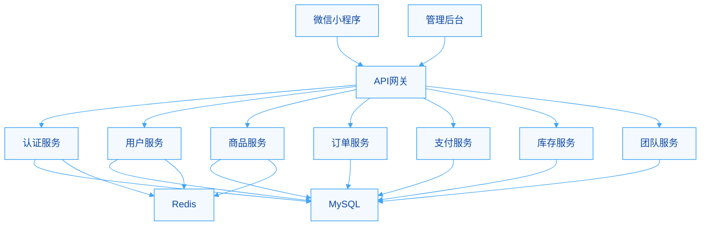

import useBaseUrl from '@docusaurus/useBaseUrl';

欢迎来到中道商城系统技术文档中心！

## 系统概述

中道商城是一个创新的多层级供应链社交电商平台，通过社交网络和供应链管理的深度结合，为用户提供独特的购物和创业体验。

### 🎯 核心特性

#### 多层级用户体系
- **用户等级**: 普通会员 → VIP → 1-5星店长 → 董事
- **团队管理**: 基于推荐关系的团队构建
- **业绩体系**: 个人业绩 + 团队业绩双重考核

#### 双店铺系统
- **云店**: 基于业绩累积升级，可持续经营
- **五通店**: 一次性购买获得特殊权益

#### 复杂业务规则
- **采购限制**: 只能向同级或上级采购
- **供应链路径**: 自动计算最优采购路径
- **佣金分配**: 多级佣金 + 平级奖励

#### 双仓库存管理
- **云仓**: 团队共享库存
- **本地仓**: 个人专属库存
- **实时同步**: 库存变动实时更新

#### 通券经济系统
- **多源流通**: 采购获得、转账、充值
- **内部循环**: 完整的通券经济生态

### 🏗️ 技术架构



### 📚 文档导航

#### 新手入门
- [快速开始](./getting-started) - 5分钟快速搭建开发环境
- [安装指南](./installation) - 详细的安装和配置说明
- [开发工作流](./development-workflow) - 了解日常开发流程

#### 架构设计
- [系统概述](./architecture/overview) - 深入了解系统设计理念
- [C4架构图](./architecture/c4-containers) - 可视化的系统架构
- [业务流程](./business-flows/user-registration) - 核心业务流程详解

#### 开发指南
- [认证授权](./guides/authentication) - 用户认证和权限控制
- [错误处理](./guides/error-handling) - 统一的错误处理机制
- [最佳实践](./guides/best-practices) - 开发规范和建议

#### API参考
- [API文档](/api) - 完整的API接口文档
- [在线调试](https://api.zhongdao-mall.com/api-docs) - 交互式API调试工具

### 🚀 快速体验

#### 1. 查看API文档
访问 [在线API文档](https://api.zhongdao-mall.com/api-docs) 查看所有可用接口。

#### 2. 克隆项目
```bash
git clone https://github.com/zhongdao/zhongdao-mall.git
cd zhongdao-mall
```

#### 3. 安装依赖
```bash
npm install
```

#### 4. 配置环境
```bash
cp .env.example .env.development
# 编辑 .env.development 配置数据库等信息
```

#### 5. 启动服务
```bash
npm run dev
```

### 📖 学习路径

#### 前端开发者
1. 了解[业务模型](./architecture/overview#业务模型)
2. 学习[API使用](./api/overview)
3. 查看[前端集成示例](./guides/frontend-integration)

#### 后端开发者
1. 阅读[架构决策记录](./adr)
2. 理解[数据库设计](./architecture/database-schema)
3. 掌握[开发规范](./guides/best-practices)

#### 运维工程师
1. 了解[部署架构](./guides/deployment)
2. 配置[监控系统](./guides/monitoring)
3. 熟悉[故障处理](./guides/troubleshooting)

### 🤝 贡献指南

我们欢迎所有形式的贡献，包括但不限于：

- 🐛 报告Bug
- 💡 提出新功能建议
- 📝 改进文档
- 🔧 提交代码

请查看我们的[贡献指南](https://github.com/zhongdao/zhongdao-mall/blob/main/CONTRIBUTING.md)了解详情。

### 📞 联系我们

- 📧 邮箱: dev@zhongdao-mall.com
- 💬 微信群: 扫描官网二维码加入
- 🐛 问题反馈: [GitHub Issues](https://github.com/zhongdao/zhongdao-mall/issues)

---

<div class="text-center padding-top--md">
  <a className="button button--primary button--lg" href="/docs/getting-started">
    开始使用 →
  </a>
</div>