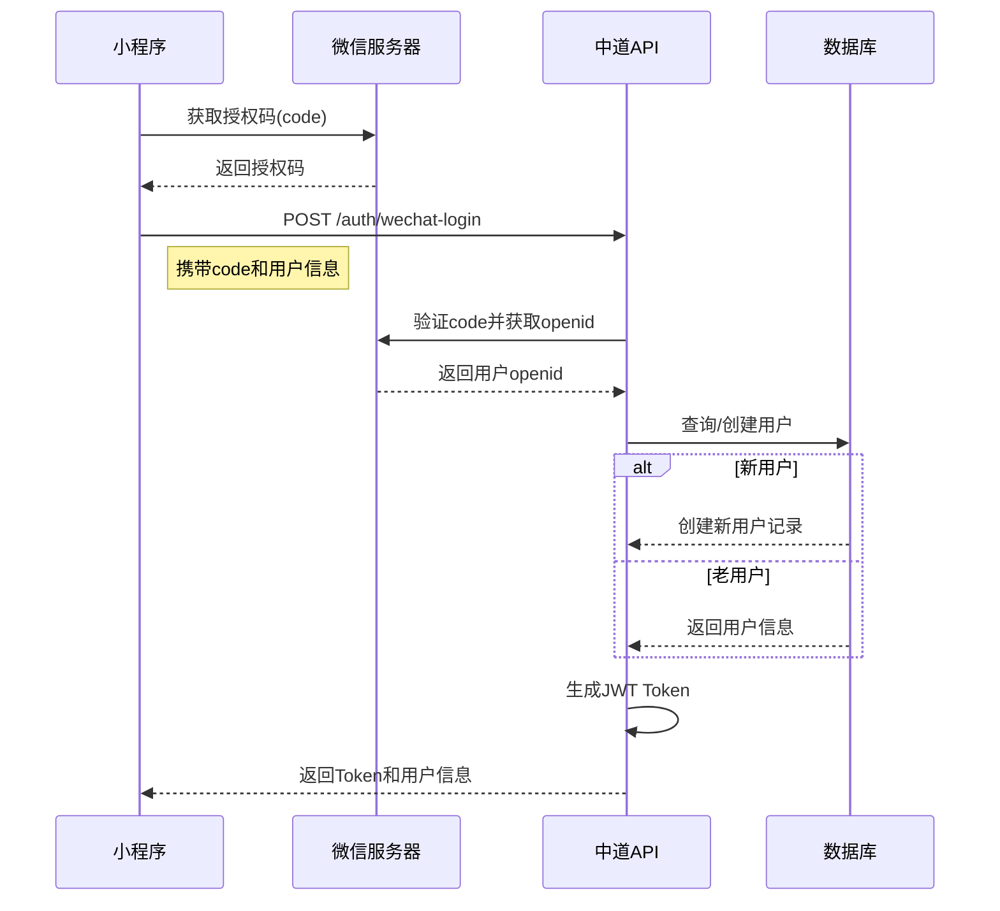

# 用户认证流程

## 概述

中道商城系统采用基于JWT（JSON Web Token）的无状态认证机制，结合微信小程序授权，提供安全可靠的用户认证服务。

## 认证架构

### 1. 微信小程序登录流程



### 2. Token管理

#### Token类型
- **Access Token**: 访问令牌，有效期2小时
- **Refresh Token**: 刷新令牌，有效期7天

#### Token格式
```json
{
  "token": "eyJhbGciOiJIUzI1NiIsInR5cCI6IkpXVCJ9...",
  "refreshToken": "eyJhbGciOiJIUzI1NiIsInR5cCI6IkpXVCJ9...",
  "user": {
    "id": "cmi1234567890abcdef",
    "openid": "wx_1234567890abcdef",
    "level": "NORMAL"
  }
}
```

## API接口详解

### 1. 微信小程序登录

**接口地址**: `POST /api/v1/auth/wechat-login`

**请求参数**:
```json
{
  "code": "071JG0000Zz1AW1R2B10009gQXx1JG0t",
  "userInfo": {
    "nickname": "张三",
    "avatarUrl": "https://wx.qlogo.cn/mmopen/xxx"
  }
}
```

**响应数据**:
```json
{
  "success": true,
  "data": {
    "token": "eyJhbGciOiJIUzI1NiIs...",
    "refreshToken": "eyJhbGciOiJIUzI1NiIs...",
    "user": {
      "id": "cmi1234567890abcdef",
      "openid": "wx_1234567890abcdef",
      "nickname": "张三",
      "avatarUrl": "https://wx.qlogo.cn/mmopen/xxx",
      "phone": null,
      "level": "NORMAL",
      "isActive": true,
      "createdAt": "2025-11-24T03:06:00.000Z"
    },
    "isNewUser": false,
    "needPhoneAuth": true
  },
  "message": "登录成功",
  "timestamp": "2025-11-24T03:06:00.000Z"
}
```

**业务逻辑**:
- 根据微信授权码获取用户openid
- 查询用户是否存在，不存在则自动注册
- 生成JWT访问令牌和刷新令牌
- 返回用户信息和认证令牌

### 2. 刷新Token

**接口地址**: `POST /api/v1/auth/refresh`

**请求头**:
```
Authorization: Bearer <refresh_token>
```

**响应数据**:
```json
{
  "success": true,
  "data": {
    "token": "eyJhbGciOiJIUzI1NiIs...",
    "refreshToken": "eyJhbGciOiJIUzI1NiIs...",
    "expiresIn": 7200
  },
  "message": "Token刷新成功"
}
```

### 3. 获取当前用户信息

**接口地址**: `GET /api/v1/users/me`

**请求头**:
```
Authorization: Bearer <access_token>
```

**响应数据**:
```json
{
  "success": true,
  "data": {
    "id": "cmi1234567890abcdef",
    "openid": "wx_1234567890abcdef",
    "nickname": "张三",
    "avatarUrl": "https://wx.qlogo.cn/mmopen/xxx",
    "phone": "13800138000",
    "level": "VIP",
    "teamPath": "root/user1/user2",
    "parentId": "cmi1234567890abcddd",
    "isActive": true,
    "performance": {
      "directCount": 5,
      "teamCount": 23,
      "totalSales": 50000.00,
      "monthlySales": 8000.00
    },
    "permissions": [
      "VIEW_PRODUCTS",
      "PLACE_ORDER",
      "VIEW_TEAM"
    ]
  },
  "message": "获取成功"
}
```

### 4. 手机号绑定

**接口地址**: `POST /api/v1/auth/bind-phone`

**请求参数**:
```json
{
  "phone": "13800138000",
  "smsCode": "123456"
}
```

**响应数据**:
```json
{
  "success": true,
  "data": {
    "phone": "13800138000",
    "isVerified": true
  },
  "message": "手机号绑定成功"
}
```

## 认证中间件

### 请求头格式
所有需要认证的接口都必须在请求头中携带JWT Token：

```
Authorization: Bearer <token>
```

### Token验证流程
1. 从请求头提取Token
2. 验证Token签名和有效期
3. 解析Token获取用户ID
4. 从数据库加载用户信息
5. 验证用户状态（是否激活、是否有权限等）

## 权限体系

### 用户等级权限

| 等级 | 权限描述 | 特殊权限 |
|------|----------|----------|
| NORMAL | 普通会员 | 基础浏览权限 |
| VIP | VIP会员 | 享受进货折扣 |
| STAR_1-5 | 星级店长 | 多级佣金、团队管理 |
| DIRECTOR | 董事 | 全部权限、平台充值 |

### 权限验证
系统在关键接口会进行权限验证：

```typescript
// 示例：验证是否为店长级别
if (user.level !== 'NORMAL' && user.level !== 'VIP') {
  // 允许访问
} else {
  // 返回权限不足
}
```

## 安全措施

### 1. Token安全
- 使用HS256算法签名
- 设置合理的有效期
- 刷新Token机制
- 服务端黑名单管理

### 2. 接口安全
- HTTPS传输加密
- 请求频率限制
- IP白名单（管理接口）
- CSRF保护

### 3. 数据安全
- 敏感信息加密存储
- 手机号脱敏显示
- 操作日志记录
- 异常登录监控

## 常见错误码

| 错误码 | 说明 | 解决方案 |
|--------|------|----------|
| TOKEN_EXPIRED | Token已过期 | 使用refreshToken刷新 |
| INVALID_TOKEN | Token无效 | 重新登录获取 |
| INSUFFICIENT_PERMISSIONS | 权限不足 | 联系管理员升级 |
| WECHAT_AUTH_FAILED | 微信认证失败 | 检查网络重试 |
| USER_NOT_FOUND | 用户不存在 | 自动注册或联系客服 |
| USER_SUSPENDED | 用户已冻结 | 联系管理员解冻 |

## 前端集成示例

### 小程序端
```javascript
// 微信登录
wx.login({
  success: async (res) => {
    if (res.code) {
      const response = await wx.request({
        url: 'https://api.zhongdao-mall.com/api/v1/auth/wechat-login',
        method: 'POST',
        data: {
          code: res.code,
          userInfo: {
            nickname: '张三',
            avatarUrl: '头像URL'
          }
        }
      });

      // 保存Token
      wx.setStorageSync('token', response.data.data.token);
      wx.setStorageSync('refreshToken', response.data.data.refreshToken);
    }
  }
});
```

### React端（Axios）
```javascript
// 创建axios实例
const api = axios.create({
  baseURL: 'https://api.zhongdao-mall.com/api/v1',
  timeout: 10000
});

// 请求拦截器 - 添加Token
api.interceptors.request.use((config) => {
  const token = localStorage.getItem('token');
  if (token) {
    config.headers.Authorization = `Bearer ${token}`;
  }
  return config;
});

// 响应拦截器 - 处理Token过期
api.interceptors.response.use(
  (response) => response,
  async (error) => {
    if (error.response?.status === 401) {
      // Token过期，尝试刷新
      const refreshToken = localStorage.getItem('refreshToken');
      if (refreshToken) {
        try {
          const response = await api.post('/auth/refresh', {}, {
            headers: { Authorization: `Bearer ${refreshToken}` }
          });

          // 更新Token
          localStorage.setItem('token', response.data.data.token);

          // 重试原请求
          error.config.headers.Authorization = `Bearer ${response.data.data.token}`;
          return api.request(error.config);
        } catch (refreshError) {
          // 刷新失败，跳转登录
          localStorage.removeItem('token');
          localStorage.removeItem('refreshToken');
          window.location.href = '/login';
        }
      }
    }
    return Promise.reject(error);
  }
);
```

## 最佳实践

1. **Token管理**
   - 使用安全的地方存储Token（小程序StorageSync、localStorage）
   - 设置合理的刷新策略
   - 退出登录时清除所有Token

2. **权限控制**
   - 前端路由守卫
   - 按钮级别权限控制
   - 请求前权限检查

3. **错误处理**
   - 统一错误处理机制
   - 友好的错误提示
   - 自动重试机制

4. **性能优化**
   - Token预加载
   - 并发请求复用Token
   - 缓存用户信息