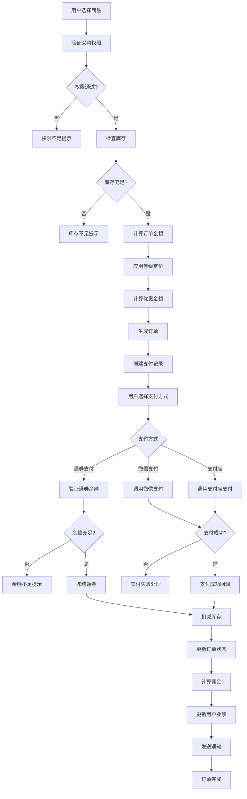

# 订单采购业务流程

## 采购业务流程图



## 核心业务规则

### 1. 采购权限验证
```typescript
async function validatePurchasePermission(userId: string, targetUserId: string) {
  // 1. 获取用户信息
  const user = await getUser(userId);
  const target = await getUser(targetUserId);

  // 2. 获取用户等级映射
  const levelMap = {
    'NORMAL': 0,
    'VIP': 1,
    'STAR_1': 2,
    'STAR_2': 3,
    'STAR_3': 4,
    'STAR_4': 5,
    'STAR_5': 6,
    'DIRECTOR': 7
  };

  // 3. 验证规则：只能从同级或上级购买
  if (levelMap[user.level] > levelMap[target.level]) {
    throw new Error('不能从下级购买商品');
  }

  // 4. 特殊规则：董事可以向任何人购买
  if (user.level === 'DIRECTOR') {
    return true;
  }

  // 5. 验证是否在同一团队链路
  const isInTeam = await checkTeamRelationship(userId, targetUserId);
  if (!isInTeam) {
    throw new Error('只能向团队成员购买商品');
  }

  return true;
}
```

### 2. 供应链路径查找
```typescript
async function findSupplyChainPath(buyerId: string, sellerId: string) {
  // 1. 获取买家团队路径
  const buyerTeam = await getTeamPath(buyerId);

  // 2. 查找最近的共同上级
  const commonAncestor = await findCommonAncestor(buyerTeam, sellerId);

  // 3. 构建供应链路径
  const path = [];
  let current = sellerId;

  while (current && current !== commonAncestor) {
    path.unshift({
      userId: current,
      role: 'supplier'
    });
    current = await getParentId(current);
  }

  // 4. 添加中间人
  if (commonAncestor && commonAncestor !== buyerId) {
    path.push({
      userId: commonAncestor,
      role: 'intermediary'
    });
  }

  return path;
}
```

### 3. 差异化定价策略
```typescript
async function calculateProductPrice(productId: string, userLevel: string) {
  // 1. 获取商品基础价格
  const product = await getProduct(productId);
  const basePrice = product.basePrice;

  // 2. 获取等级折扣配置
  const levelDiscounts = {
    'NORMAL': 1.0,      // 无折扣
    'VIP': 0.95,        // 95折
    'STAR_1': 0.90,     // 9折
    'STAR_2': 0.85,     // 85折
    'STAR_3': 0.80,     // 8折
    'STAR_4': 0.75,     // 75折
    'STAR_5': 0.70,     // 7折
    'DIRECTOR': 0.65    // 65折
  };

  // 3. 计算最终价格
  const discount = levelDiscounts[userLevel] || 1.0;
  const finalPrice = basePrice * discount;

  return {
    basePrice,
    discount,
    finalPrice,
    savedAmount: basePrice - finalPrice
  };
}
```

## 佣金计算逻辑

### 1. 多级佣金分配
```typescript
async function calculateCommission(orderId: string, supplyChain: any[]) {
  const order = await getOrder(orderId);
  const totalAmount = order.totalAmount;

  // 1. 佣金比例配置
  const commissionRates = {
    supplier: 0.15,        // 供应商15%
    intermediary: 0.05,    // 中间人5%
    levelBonus: {
      STAR_1: 0.02,
      STAR_2: 0.03,
      STAR_3: 0.04,
      STAR_4: 0.05,
      STAR_5: 0.06,
      DIRECTOR: 0.08
    }
  };

  // 2. 计算各角色佣金
  const commissions = [];

  for (const node of supplyChain) {
    const user = await getUser(node.userId);
    let commissionAmount = 0;

    if (node.role === 'supplier') {
      commissionAmount = totalAmount * commissionRates.supplier;
    } else if (node.role === 'intermediary') {
      commissionAmount = totalAmount * commissionRates.intermediary;
    }

    // 3. 等级奖励
    const levelBonusRate = commissionRates.levelBonus[user.level] || 0;
    const levelBonus = totalAmount * levelBonusRate;
    commissionAmount += levelBonus;

    // 4. 记录佣金
    commissions.push({
      userId: node.userId,
      orderId,
      amount: commissionAmount,
      type: node.role,
      level: user.level,
      status: 'PENDING'
    });
  }

  // 5. 批量保存佣金记录
  await createCommissions(commissions);

  return commissions;
}
```

### 2. 平级奖励机制
```typescript
async function calculatePeerReward(orderId: string, buyerId: string) {
  // 1. 获取买家信息
  const buyer = await getUser(buyerId);
  const buyerLevel = buyer.level;

  // 2. 查找同级团队成员
  const peers = await findPeers(buyerId, buyerLevel);

  // 3. 平级奖励规则
  if (peers.length > 0 && ['STAR_3', 'STAR_4', 'STAR_5'].includes(buyerLevel)) {
    const totalReward = await getOrderTotal(orderId) * 0.01; // 1%平级奖励
    const rewardPerPerson = totalReward / peers.length;

    // 4. 分发平级奖励
    for (const peer of peers) {
      await createPeerReward({
        userId: peer.id,
        orderId,
        amount: rewardPerPerson,
        type: 'PEER_REWARD',
        triggeredBy: buyerId
      });
    }
  }
}
```

## 库存管理流程

### 1. 多仓库库存检查
```typescript
async function checkInventory(productId: string, quantity: number, warehouseType: string) {
  // 1. 获取商品库存信息
  const inventories = await getInventoryByProduct(productId);

  // 2. 库存优先级：本地仓 > 云仓 > 平台仓
  const warehousePriority = ['LOCAL', 'CLOUD', 'PLATFORM'];

  let availableQuantity = 0;
  let selectedWarehouse = null;

  for (const warehouse of warehousePriority) {
    const inventory = inventories.find(inv => inv.warehouseType === warehouse);

    if (inventory && inventory.quantity >= quantity) {
      selectedWarehouse = warehouse;
      availableQuantity = inventory.quantity;
      break;
    }
  }

  if (!selectedWarehouse) {
    throw new Error('库存不足');
  }

  return {
    warehouse: selectedWarehouse,
    availableQuantity,
    canPurchase: true
  };
}
```

### 2. 库存扣减流程
```typescript
async function deductInventory(orderId: string) {
  const order = await getOrder(orderId);

  // 使用事务确保库存一致性
  await prisma.$transaction(async (tx) => {
    for (const item of order.items) {
      // 1. 检查库存锁
      const lockKey = `inventory:${item.productId}`;
      const isLocked = await redis.get(lockKey);

      if (isLocked) {
        throw new Error(`商品 ${item.productId} 正在处理中，请稍后重试`);
      }

      // 2. 加锁
      await redis.setex(lockKey, 30, 'locked');

      try {
        // 3. 扣减库存
        await tx.inventoryItem.update({
          where: {
            productId: item.productId,
            warehouseType: item.warehouseType
          },
          data: {
            quantity: {
              decrement: item.quantity
            }
          }
        });

        // 4. 记录库存流水
        await tx.inventoryLog.create({
          data: {
            productId: item.productId,
            warehouseType: item.warehouseType,
            quantity: -item.quantity,
            type: 'SALE',
            orderId: order.id,
            remark: `订单扣减库存`
          }
        });

      } finally {
        // 5. 释放锁
        await redis.del(lockKey);
      }
    }
  });
}
```

## 异常处理机制

### 1. 支付失败处理
```typescript
async function handlePaymentFailure(paymentId: string, reason: string) {
  // 1. 获取支付记录
  const payment = await getPayment(paymentId);

  // 2. 恢复库存
  if (payment.orderId) {
    await restoreInventory(payment.orderId);
  }

  // 3. 释放通券（如果使用通券支付）
  if (payment.method === 'POINTS') {
    await unfreezePoints(payment.userId, payment.amount);
  }

  // 4. 更新订单状态
  await updateOrderStatus(payment.orderId, 'PAYMENT_FAILED');

  // 5. 记录失败原因
  await logPaymentFailure(paymentId, reason);
}
```

### 2. 订单超时处理
```typescript
// 定时任务处理超时订单
cron.schedule('*/5 * * * *', async () => {
  const timeoutOrders = await findTimeoutOrders(); // 30分钟未支付

  for (const order of timeoutOrders) {
    // 1. 自动取消订单
    await cancelOrder(order.id, 'TIMEOUT');

    // 2. 恢复库存
    await restoreInventory(order.id);

    // 3. 发送通知
    await sendOrderTimeoutNotification(order.userId, order.id);
  }
});
```