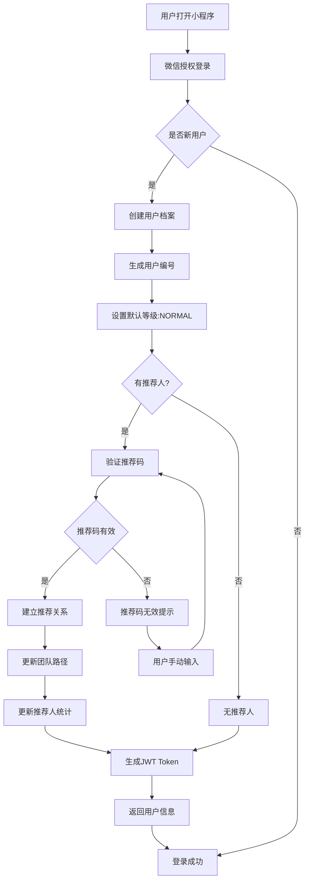

# 用户注册和团队关系流程

## 业务流程图



## 详细流程说明

### 1. 微信授权登录
```typescript
// 调用微信登录接口
wx.login({
  success: async (res) => {
    if (res.code) {
      // 发送code到后端
      const response = await api.post('/auth/wechat-login', {
        code: res.code,
        userInfo: userInfo
      });
    }
  }
});
```

### 2. 用户创建流程
```typescript
// 后端处理
async function handleWechatLogin(code: string, userInfo: any) {
  // 1. 通过code获取openid
  const openid = await getWechatOpenid(code);

  // 2. 查询用户是否存在
  let user = await findUserByOpenid(openid);

  if (!user) {
    // 3. 创建新用户
    user = await createUser({
      openid,
      nickname: userInfo.nickname,
      avatarUrl: userInfo.avatarUrl,
      userNumber: await generateUserNumber(),
      level: 'NORMAL'
    });

    // 4. 处理推荐关系
    if (userInfo.referrerCode) {
      await handleReferral(user.id, userInfo.referrerCode);
    }
  }

  // 5. 生成JWT
  const token = generateJWT(user);

  return { user, token };
}
```

### 3. 推荐关系处理
```typescript
async function handleReferral(userId: string, referrerCode: string) {
  // 1. 验证推荐码
  const referrer = await findUserByReferralCode(referrerCode);
  if (!referrer) {
    throw new Error('推荐码无效');
  }

  // 2. 建立推荐关系
  await updateUser(userId, {
    parentId: referrer.id,
    teamPath: `${referrer.teamPath}/${userId}`
  });

  // 3. 更新推荐人统计
  await incrementReferrerCount(referrer.id);

  // 4. 记录推荐奖励（如果适用）
  if (shouldGiveReferralBonus(referrer.level)) {
    await createReferralBonus(referrer.id, userId);
  }
}
```

## 团队路径设计

### 数据结构
```sql
-- 用户表
users {
  id: string (主键)
  openid: string (微信唯一标识)
  userNumber: string (系统编号)
  parentId: string (推荐人ID)
  teamPath: string (团队路径)
  level: enum (用户等级)
  directCount: int (直推人数)
  teamCount: int (团队人数)
  createdAt: datetime
  updatedAt: datetime
}

-- 推荐关系索引
CREATE INDEX idx_users_parentId ON users(parentId);
CREATE INDEX idx_users_teamPath ON users(teamPath(100));
```

### 路径示例
```
用户A (根节点)
├── teamPath: "root/A"
└── 直接推荐: B, C, D

    用户B
    ├── teamPath: "root/A/B"
    └── 直接推荐: E, F

        用户E
        ├── teamPath: "root/A/B/E"
        └── 直接推荐: G, H
```

### 层级查询优化
```typescript
// 查询某用户的所有下级
async function getSubordinates(userId: string) {
  // 使用LIKE查询团队路径
  return await prisma.users.findMany({
    where: {
      teamPath: {
        startsWith: `root/${userId}`
      }
    },
    orderBy: {
      teamPath: 'asc'
    }
  });
}

// 查询直属下级
async function getDirectSubordinates(parentId: string) {
  return await prisma.users.findMany({
    where: {
      parentId
    }
  });
}
```

## 业务规则

### 1. 推荐关系规则
- 每个用户只能有一个推荐人
- 推荐关系一旦建立不可更改
- 不能推荐自己或已存在推荐关系的用户
- 推荐码有效期30天

### 2. 团队计算规则
```typescript
// 计算团队人数
async function calculateTeamCount(userId: string) {
  // 1. 获取所有下级
  const subordinates = await getSubordinates(userId);

  // 2. 递归计算
  let total = 0;
  for (const sub of subordinates) {
    total += 1 + await calculateTeamCount(sub.id);
  }

  // 3. 更新统计
  await updateUser(userId, { teamCount: total });

  return total;
}
```

### 3. 等级升级规则
```typescript
const levelRequirements = {
  VIP: {
    directCount: 5,
    teamCount: 20,
    personalSales: 10000
  },
  STAR_1: {
    directCount: 10,
    teamCount: 50,
    personalSales: 30000
  },
  STAR_2: {
    directCount: 20,
    teamCount: 100,
    personalSales: 80000
  },
  // ... 更多等级
};

async function checkLevelUpgrade(userId: string) {
  const user = await getUser(userId);
  const stats = await getUserStats(userId);

  for (const [level, req] of Object.entries(levelRequirements)) {
    if (stats.directCount >= req.directCount &&
        stats.teamCount >= req.teamCount &&
        stats.personalSales >= req.personalSales) {
      await upgradeLevel(userId, level);
      break;
    }
  }
}
```

## 异常处理

### 1. 推荐码异常
- 推荐码不存在：提示用户输入正确的推荐码
- 推荐码已过期：提示联系推荐人获取新码
- 推荐关系已存在：提示用户已有推荐人

### 2. 数据一致性
- 使用数据库事务确保数据一致性
- 实现重试机制处理并发问题
- 定期校验和修复数据一致性

### 3. 性能优化
- 缓存用户团队关系
- 异步处理统计数据更新
- 使用消息队列处理推荐奖励