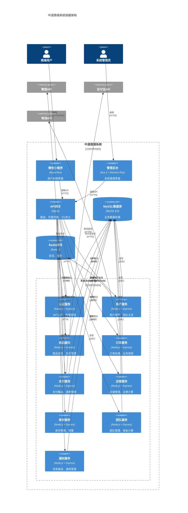

# C4模型：容器图

## 容器架构图



## 容器详细说明

### 1. 微信小程序 (web_app)
- **技术栈**: React/Vue + TypeScript
- **职责**:
  - 商品展示和搜索
  - 购物车和下单
  - 支付和订单管理
  - 团队管理
  - 个人中心
- **部署**: 微信小程序平台

### 2. 管理后台 (admin_console)
- **技术栈**: Vue 3 + Element Plus + TypeScript
- **职责**:
  - 商品管理
  - 订单处理
  - 用户管理
  - 数据统计
  - 系统配置
- **部署**: 阿里云/腾讯云

### 3. API网关 (api_gateway)
- **技术栈**: Nginx + Lua
- **职责**:
  - 请求路由
  - 负载均衡
  - SSL终止
  - 限流熔断
  - 请求日志

### 4. 认证服务 (auth_service)
- **职责**:
  - JWT令牌管理
  - 用户认证
  - 权限验证
  - 会话管理
- **特性**:
  - 无状态设计
  - 刷新令牌机制
  - 多级权限控制

### 5. 用户服务 (user_service)
- **职责**:
  - 用户注册/登录
  - 用户信息管理
  - 团队关系维护
  - 等级管理
- **核心逻辑**:
  - 推荐关系链
  - 层级计算
  - 业绩统计

### 6. 商品服务 (product_service)
- **职责**:
  - 商品目录管理
  - 分类和标签
  - 定价策略
  - 规格管理
- **特性**:
  - 差异化定价
  - 库存关联
  - 状态管理

### 7. 订单服务 (order_service)
- **职责**:
  - 订单创建
  - 业务规则验证
  - 订单流转
  - 业绩计算
- **核心规则**:
  - 采购权限验证
  - 供应链路径
  - 佣金预计算

### 8. 支付服务 (payment_service)
- **职责**:
  - 支付接口集成
  - 通券管理
  - 退款处理
  - 资金记录
- **集成**:
  - 微信支付
  - 支付宝
  - 通券系统

### 9. 店铺服务 (shop_service)
- **职责**:
  - 店铺管理
  - 业绩统计
  - 升级计算
  - 权限管理
- **类型**:
  - 云店管理
  - 五通店管理

### 10. 库存服务 (inventory_service)
- **职责**:
  - 多仓库管理
  - 库存同步
  - 预警通知
  - 调拨管理
- **仓库类型**:
  - 平台仓
  - 云仓
  - 本地仓

### 11. 团队服务 (team_service)
- **职责**:
  - 团队结构管理
  - 佣金计算
  - 绩效统计
  - 排名系统
- **计算规则**:
  - 多级佣金
  - 平级奖励
  - 特殊奖励

### 12. 通知服务 (notification_service)
- **职责**:
  - 消息推送
  - 通知模板
  - 渠道管理
  - 发送记录
- **渠道**:
  - 微信模板消息
  - 短信
  - 邮件

## 技术选型说明

### 为什么选择Node.js
- 高并发处理能力
- TypeScript原生支持
- 丰富的生态系统
- 与前端技术栈统一

### 为什么选择MySQL
- 事务支持完善
- 复杂查询能力强
- 成熟稳定
- 团队熟悉度高

### 为什么选择Redis
- 高性能缓存
- 丰富的数据结构
- 持久化支持
- 集群扩展能力

## 部署架构

### 容器化部署
```yaml
# docker-compose.yml
services:
  - nginx (API网关)
  - app (后端服务)
  - mysql (数据库)
  - redis (缓存)
```

### 扩展性设计
- 服务无状态设计
- 数据库读写分离
- 缓存集群部署
- 负载均衡配置