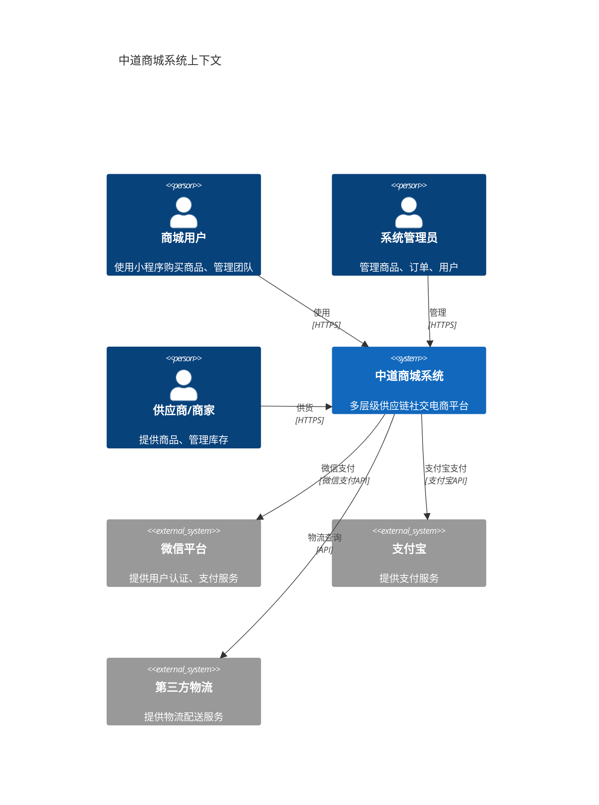
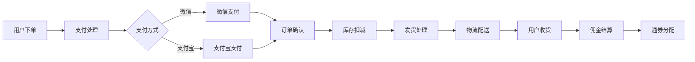

# C4模型：系统上下文

## 系统上下文图

## 系统概述

中道商城系统是一个多层级供应链社交电商平台，核心特点：

1. **多层级用户体系**
   - 普通会员 → VIP → 1-5星店长 → 董事
   - 团队层级管理和业绩计算
   - 推荐关系和佣金分配

2. **双店铺系统**
   - 云店：业绩累积升级
   - 五通店：特殊权益一次性购买

3. **复杂业务规则**
   - 层级采购限制
   - 中间人业绩奖励
   - 平级奖励机制

4. **双仓库存管理**
   - 云仓：团队共享
   - 本地仓：个人独有

5. **通券经济系统**
   - 多源通券循环
   - 转账、充值、消费

## 外部依赖

### 微信平台
- **用户认证**: 通过微信OpenID识别用户
- **微信支付**: 小程序内支付
- **消息通知**: 模板消息推送

### 支付宝
- **支付渠道**: 支付宝支付
- **资金结算**: 商户资金管理

### 物流公司
- **物流跟踪**: 订单物流状态
- **配送管理**: 配送信息更新

## 数据流向

## 安全边界

### 信任边界
- 内部系统：完全信任
- 用户客户端：部分信任
- 第三方服务：有限信任

### 数据保护
- 用户隐私数据加密存储
- 支付信息PCI DSS合规
- 传输层TLS加密

## 合规要求

1. **数据保护**
   - 个人信息保护法
   - 用户数据最小化原则

2. **支付安全**
   - PCI DSS标准
   - 支付数据不落地

3. **业务合规**
   - 电商法合规
   - 税务合规要求