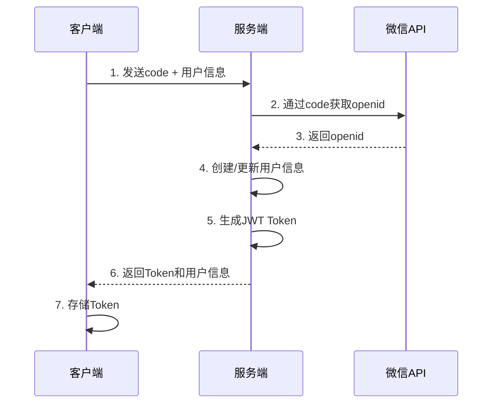

# 认证授权开发指南

## 认证体系概述

中道商城系统采用基于JWT（JSON Web Token）的无状态认证机制，支持多层级权限控制和多终端统一认证。

## 认证流程

### 1. 微信小程序登录流程



### 2. 客户端实现

```typescript
// 登录请求
interface LoginRequest {
  code: string;        // 微信授权码
  nickname?: string;   // 用户昵称
  avatarUrl?: string;  // 头像URL
}

// 登录响应
interface LoginResponse {
  token: string;       // JWT访问令牌
  refreshToken: string;// 刷新令牌
  user: {
    id: string;
    openid: string;
    nickname: string;
    level: UserLevel;
    status: UserStatus;
  };
}

// 调用登录接口
async function login(userInfo: LoginRequest): Promise<LoginResponse> {
  const response = await api.post('/auth/wechat-login', userInfo);

  // 存储令牌
  localStorage.setItem('token', response.data.token);
  localStorage.setItem('refreshToken', response.data.refreshToken);

  return response.data;
}
```

## 权限体系设计

### 1. 用户级别权限

```typescript
enum UserLevel {
  NORMAL = 'NORMAL',        // 普通用户
  VIP = 'VIP',             // VIP会员
  STAR_1 = 'STAR_1',       // 1星店长
  STAR_2 = 'STAR_2',       // 2星店长
  STAR_3 = 'STAR_3',       // 3星店长
  STAR_4 = 'STAR_4',       // 4星店长
  STAR_5 = 'STAR_5',       // 5星店长
  DIRECTOR = 'DIRECTOR'    // 董事
}

// 权限级别映射
const LEVEL_PERMISSIONS = {
  [UserLevel.NORMAL]: {
    canPurchase: true,
    maxPurchaseAmount: 10000,
    teamViewDepth: 0
  },
  [UserLevel.VIP]: {
    canPurchase: true,
    maxPurchaseAmount: 50000,
    teamViewDepth: 1
  },
  [UserLevel.STAR_1]: {
    canPurchase: true,
    maxPurchaseAmount: 100000,
    teamViewDepth: 2
  },
  // ... 更多级别配置
};
```

### 2. 功能权限控制

```typescript
// 权限装饰器
export function RequireLevel(minLevel: UserLevel) {
  return function (target: any, propertyKey: string, descriptor: PropertyDescriptor) {
    const originalMethod = descriptor.value;

    descriptor.value = async function (...args: any[]) {
      const req = args[0]; // Express Request
      const userLevel = req.user?.level;

      if (!hasMinimumLevel(userLevel, minLevel)) {
        throw new ForbiddenError('权限不足');
      }

      return originalMethod.apply(this, args);
    };
  };
}

// 使用示例
class ShopController {
  @RequireLevel(UserLevel.STAR_1)
  async createShop(req: Request, res: Response) {
    // 创建店铺逻辑
  }

  @RequireLevel(UserLevel.DIRECTOR)
  async approveShop(req: Request, res: Response) {
    // 审批店铺逻辑
  }
}
```

### 3. 业务权限验证

```typescript
// 采购权限验证
async function validatePurchasePermission(buyerId: string, sellerId: string): Promise<boolean> {
  // 1. 获取用户信息
  const buyer = await getUser(buyerId);
  const seller = await getUser(sellerId);

  // 2. 董事可以向任何人购买
  if (buyer.level === UserLevel.DIRECTOR) {
    return true;
  }

  // 3. 不能向下级购买
  const buyerLevelValue = getLevelValue(buyer.level);
  const sellerLevelValue = getLevelValue(seller.level);

  if (buyerLevelValue > sellerLevelValue) {
    throw new BusinessError('不能从下级购买商品');
  }

  // 4. 必须在同一团队链路
  const isInTeamChain = await checkTeamRelationship(buyerId, sellerId);
  if (!isInTeamChain) {
    throw new BusinessError('只能向团队成员购买');
  }

  return true;
}
```

## Token管理

### 1. JWT Token结构

```typescript
// JWT Payload
interface JWTPayload {
  sub: string;          // 用户ID
  role: 'USER' | 'ADMIN';
  level: UserLevel;     // 用户等级
  scope: string[];      // 权限范围
  iat: number;          // 签发时间
  exp: number;          // 过期时间
  jti: string;          // Token ID
}

// 生成Token
export function generateToken(user: User): string {
  const payload: JWTPayload = {
    sub: user.id,
    role: 'USER',
    level: user.level,
    scope: generateScope(user.level),
    iat: Math.floor(Date.now() / 1000),
    exp: Math.floor(Date.now() / 1000) + (15 * 60), // 15分钟
    jti: generateTokenId()
  };

  return jwt.sign(payload, process.env.JWT_SECRET!, {
    algorithm: 'HS256'
  });
}
```

### 2. Token刷新机制

```typescript
// 刷新Token
export async function refreshToken(refreshToken: string): Promise<TokenPair> {
  try {
    // 1. 验证刷新Token
    const decoded = jwt.verify(refreshToken, process.env.JWT_REFRESH_SECRET!) as any;

    // 2. 检查Token是否在黑名单
    const isBlacklisted = await checkTokenBlacklist(decoded.jti);
    if (isBlacklisted) {
      throw new UnauthorizedError('Token已失效');
    }

    // 3. 获取最新用户信息
    const user = await getUser(decoded.sub);
    if (!user || user.status !== 'ACTIVE') {
      throw new UnauthorizedError('用户状态异常');
    }

    // 4. 生成新的Token对
    const accessToken = generateToken(user);
    const newRefreshToken = generateRefreshToken(user);

    // 5. 将旧Token加入黑名单
    await addToBlacklist(decoded.jti);

    return {
      accessToken,
      refreshToken: newRefreshToken
    };
  } catch (error) {
    throw new UnauthorizedError('刷新Token无效');
  }
}
```

### 3. Token黑名单

```typescript
// Redis实现Token黑名单
class TokenBlacklist {
  private redis: Redis;

  async addToBlacklist(jti: string, exp: number): Promise<void> {
    const ttl = exp - Math.floor(Date.now() / 1000);
    if (ttl > 0) {
      await this.redis.setex(`blacklist:${jti}`, ttl, '1');
    }
  }

  async isBlacklisted(jti: string): Promise<boolean> {
    const result = await this.redis.get(`blacklist:${jti}`);
    return result === '1';
  }

  async clearExpiredTokens(): Promise<void> {
    // Redis会自动清理过期的键
  }
}
```

## 中间件实现

### 1. 认证中间件

```typescript
export const authenticate = async (
  req: Request,
  res: Response,
  next: NextFunction
): Promise<void> => {
  try {
    // 1. 获取Token
    const authHeader = req.headers.authorization;
    if (!authHeader || !authHeader.startsWith('Bearer ')) {
      throw new UnauthorizedError('缺少认证令牌');
    }

    const token = authHeader.substring(7);

    // 2. 验证Token
    const decoded = jwt.verify(token, process.env.JWT_SECRET!) as JWTPayload;

    // 3. 检查Token黑名单
    if (await tokenBlacklist.isBlacklisted(decoded.jti)) {
      throw new UnauthorizedError('Token已失效');
    }

    // 4. 获取用户信息
    const user = await getUser(decoded.sub);
    if (!user || user.status !== 'ACTIVE') {
      throw new UnauthorizedError('用户不存在或已禁用');
    }

    // 5. 检查用户等级是否变化
    if (user.level !== decoded.level) {
      throw new UnauthorizedError('用户等级已变更，请重新登录');
    }

    // 6. 将用户信息附加到请求对象
    req.user = {
      id: user.id,
      level: user.level,
      role: decoded.role,
      scope: decoded.scope
    };

    next();
  } catch (error) {
    if (error instanceof jwt.JsonWebTokenError) {
      next(new UnauthorizedError('Token无效'));
    } else if (error instanceof jwt.TokenExpiredError) {
      next(new UnauthorizedError('Token已过期'));
    } else {
      next(error);
    }
  }
};
```

### 2. 权限检查中间件

```typescript
export const requirePermission = (permission: string) => {
  return (req: Request, res: Response, next: NextFunction): void => {
    if (!req.user) {
      return next(new UnauthorizedError('未认证'));
    }

    if (!req.user.scope.includes(permission)) {
      return next(new ForbiddenError('权限不足'));
    }

    next();
  };
};

export const requireLevel = (minLevel: UserLevel) => {
  return (req: Request, res: Response, next: NextFunction): void => {
    if (!req.user) {
      return next(new UnauthorizedError('未认证'));
    }

    if (!hasMinimumLevel(req.user.level, minLevel)) {
      return next(new ForbiddenError('用户等级不足'));
    }

    next();
  };
};
```

## 安全最佳实践

### 1. Token安全

```typescript
// 配置安全的Cookie
app.use(express.json());
app.use(cookie({
  httpOnly: true,      // 防止XSS攻击
  secure: true,        // 仅HTTPS
  sameSite: 'strict',  // 防止CSRF攻击
  maxAge: 24 * 60 * 60 * 1000 // 24小时
}));

// 设置安全头
app.use(helmet({
  contentSecurityPolicy: {
    directives: {
      defaultSrc: ["'self'"],
      scriptSrc: ["'self'", "'unsafe-inline'"],
      styleSrc: ["'self'", "'unsafe-inline'"]
    }
  }
}));
```

### 2. 防暴力破解

```typescript
// 登录限流
const loginLimiter = rateLimit({
  windowMs: 15 * 60 * 1000, // 15分钟
  max: 5,                   // 最多5次尝试
  message: '登录尝试次数过多，请稍后再试',
  standardHeaders: true,
  legacyHeaders: false
});

app.post('/auth/login', loginLimiter, loginHandler);
```

### 3. 会话管理

```typescript
// 强制登出所有设备
async function forceLogoutAllDevices(userId: string): Promise<void> {
  // 1. 获取用户所有活跃的Token
  const activeTokens = await getActiveTokens(userId);

  // 2. 将所有Token加入黑名单
  for (const token of activeTokens) {
    await tokenBlacklist.addToBlacklist(token.jti, token.exp);
  }

  // 3. 清除用户会话缓存
  await clearUserSessionCache(userId);

  // 4. 发送安全通知
  await sendSecurityNotification(userId, '所有设备已强制登出');
}
```

## 测试认证

### 1. 生成测试Token

```typescript
// 测试工具脚本
import { generateToken } from '../src/shared/middleware/auth';

const testUsers = {
  normal: {
    id: 'test-normal-user-id',
    level: UserLevel.NORMAL,
    role: 'USER'
  },
  vip: {
    id: 'test-vip-user-id',
    level: UserLevel.VIP,
    role: 'USER'
  },
  director: {
    id: 'test-director-user-id',
    level: UserLevel.DIRECTOR,
    role: 'USER'
  },
  admin: {
    id: 'test-admin-user-id',
    level: UserLevel.DIRECTOR,
    role: 'ADMIN'
  }
};

// 生成测试Token
for (const [type, user] of Object.entries(testUsers)) {
  const token = generateToken(user);
  console.log(`${type} Token: ${token}`);
}
```

### 2. API测试示例

```typescript
// 使用认证Token测试API
describe('Protected API', () => {
  it('should access with valid token', async () => {
    const token = generateTestToken('vip');

    const response = await request(app)
      .get('/api/v1/shops')
      .set('Authorization', `Bearer ${token}`)
      .expect(200);

    expect(response.body.success).toBe(true);
  });

  it('should reject with invalid token', async () => {
    const response = await request(app)
      .get('/api/v1/shops')
      .set('Authorization', 'Bearer invalid-token')
      .expect(401);

    expect(response.body.success).toBe(false);
  });
});
```

## 故障排除

### 常见认证问题

1. **Token过期**
   - 检查客户端是否正确实现刷新逻辑
   - 验证Token有效期设置

2. **跨域问题**
   - 确保CORS配置正确
   - 检查预检请求处理

3. **权限错误**
   - 验证用户等级和权限映射
   - 检查权限检查逻辑

4. **性能问题**
   - 优化Token验证逻辑
   - 使用缓存减少数据库查询