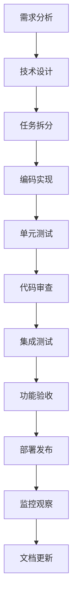

# 中道商城系统 - 开发流程与代码规范

**文档目的**：定义完整的开发流程、代码规范和协作机制
**适用范围**：所有参与项目开发的AI协作者和人类开发者
**最后更新**：2025年11月18日
**版本**：1.0

---

## 🔄 开发流程规范

### 🎯 开发周期管理

#### 功能开发流程



#### 详细的开发阶段

**1. 需求分析阶段（必须完成）**
```bash
# 需求分析检查清单
□ 理解业务需求的背景和价值
□ 明确功能边界和约束条件
□ 识别技术风险和依赖关系
□ 评估开发工作量和时间
□ 输出技术设计方案
```

**2. 技术设计阶段（必须完成）**
```bash
# 技术设计要点
□ API接口设计（遵循RESTful规范）
□ 数据库表结构设计（遵循数据库规范）
□ 核心算法和业务逻辑设计
□ 错误处理和异常场景设计
□ 性能优化方案
□ 安全性考虑
```

**3. 编码实现阶段（严格遵循规范）**
```bash
# 编码要求
□ TypeScript严格模式，避免any类型
□ 遵循代码风格规范
□ 编写清晰的注释和文档
□ 实现完整的错误处理
□ 遵循业务逻辑约束
```

### 📝 代码提交规范

#### 提交信息格式

```bash
# 提交格式
<type>(<scope>): <subject>

<body>

<footer>
```

#### 提交类型说明

```typescript
// 提交类型定义
type CommitType =
  | 'feat'     // 新功能
  | 'fix'      // 修复bug
  | 'docs'     // 文档更新
  | 'style'    // 代码格式调整
  | 'refactor' // 重构代码
  | 'perf'     // 性能优化
  | 'test'     // 测试相关
  | 'chore'    // 构建过程或工具变动
  | 'revert'   // 回滚提交
  | 'build'    // 构建系统
  | 'ci'       // CI配置
  | 'hotfix'   // 紧急修复;

// 示例提交
feat(user): add user level upgrade logic

- Implement upgrade algorithm based on sales volume
- Add team structure validation
- Include automatic downgrade mechanism

Closes #123
```

#### 提交检查清单

```bash
# 提交前检查
□ 代码编译通过（npm run type-check）
□ 单元测试通过（npm test）
□ 代码风格检查通过（npm run lint）
□ 功能测试验证完成
□ 文档更新完成
□ 提交信息格式正确
```

---

## 📋 代码审查规范

### 👥 审查角色和职责

#### 审查者类型

| 审查者 | 角色 | 审查重点 | 审查权限 |
|--------|------|----------|----------|
| **架构师AI** | 技术架构审查 | 架构设计、技术选型、性能方案 | 架构否决权 |
| **领域AI** | 业务逻辑审查 | 业务规则正确性、数据一致性 | 业务否决权 |
| **测试AI** | 质量审查 | 测试覆盖、错误处理、边界情况 | 质量否决权 |
| **安全AI** | 安全审查 | 安全漏洞、权限控制、数据保护 | 安全否决权 |

#### 审查流程

```typescript
// 代码审查流程
interface CodeReview {
  // 1. 创建审查请求
  createReview(pullRequest: PullRequest): ReviewRequest;

  // 2. 自动检查
  runAutomatedChecks(review: ReviewRequest): CheckResults;

  // 3. 人工审查
  humanReview(review: ReviewRequest): ReviewFeedback[];

  // 4. 审查决策
  makeDecision(feedback: ReviewFeedback[]): ReviewDecision;
}

// 审查决策类型
type ReviewDecision =
  | 'approve'     // 直接通过
  | 'approve_with_suggestions' // 通过但建议修改
  | 'request_changes' // 需要修改
  | 'reject'      // 拒绝合并
  | 'hold'        // 暂缓审查;
```

### 🔍 审查检查清单

#### 架构设计审查

```bash
# 架构审查要点
□ 模块职责是否清晰单一
□ 依赖关系是否合理
□ 接口设计是否清晰
□ 扩展性是否良好
□ 性能是否满足要求
□ 数据库设计是否合理
```

#### 业务逻辑审查

```bash
# 业务逻辑审查要点
□ 是否符合业务规则约束
□ 用户等级逻辑是否正确
□ 采购权限验证是否完整
□ 通券流转是否安全
□ 库存管理逻辑是否正确
□ 佣金计算是否准确
```

#### 代码质量审查

```bash
# 代码质量审查要点
□ 代码是否易于理解和维护
□ 变量和函数命名是否清晰
□ 是否有重复代码
□ 错误处理是否完整
□ 测试覆盖是否充分
□ 文档是否完整
```

#### 安全性审查

```bash
# 安全性审查要点
□ 是否有SQL注入风险
□ 是否有XSS风险
□ 权限控制是否完善
□ 敏感数据是否加密
□ API接口是否安全
□ 业务逻辑漏洞检查
```

---

## 📐 编码规范

### 🎨 TypeScript编码规范

#### 类型定义规范

```typescript
// 1. 严格的类型定义
interface User {
  readonly id: string;
  nickname: string;
  level: UserLevel;
  status: UserStatus;
  createdAt: Date;
  updatedAt: Date;
}

// 使用联合类型而不是枚举
type UserLevel = 'normal' | 'vip' | 'star_1' | 'star_2' | 'star_3' | 'star_4' | 'star_5' | 'director';
type UserStatus = 'active' | 'inactive' | 'suspended';

// 2. 函数类型定义
type UserService = {
  getUserById(id: string): Promise<User | null>;
  createUser(userData: CreateUserDto): Promise<User>;
  updateUser(id: string, updates: UpdateUserDto): Promise<User>;
};

// 3. 严格的泛型使用
interface ApiResponse<T> {
  success: boolean;
  data?: T;
  error?: ErrorInfo;
  timestamp: string;
}

// 4. 避免any类型，使用unknown
function processUnknownData(data: unknown): void {
  if (typeof data === 'string') {
    console.log(data);
  }
}
```

#### 函数编写规范

```typescript
// 1. 函数命名要清晰明确
class UserService {
  // ✅ 好的命名
  async calculateUserLevel(userId: string): Promise<UserLevel> {
    // 实现用户等级计算
  }

  async validatePurchasePermission(buyerId: string, sellerId: string): Promise<boolean> {
    // 验证采购权限
  }

  // ❌ 不好的命名
  async calc(userId: string): Promise<UserLevel> {
    // 命名不清晰
  }
}

// 2. 函数要单一职责
class PointsService {
  // ✅ 单一职责
  async transferPoints(fromUserId: string, toUserId: string, amount: number): Promise<void> {
    await this.validateBalance(fromUserId, amount);
    await this.processTransfer(fromUserId, toUserId, amount);
    await this.recordTransaction(fromUserId, toUserId, amount);
  }

  private async validateBalance(userId: string, amount: number): Promise<void> {
    // 验证余额逻辑
  }

  private async processTransfer(fromId: string, toId: string, amount: number): Promise<void> {
    // 处理转账逻辑
  }

  private async recordTransaction(fromId: string, toId: string, amount: number): Promise<void> {
    // 记录流水逻辑
  }
}

// 3. 完整的错误处理
class InventoryService {
  async transferToWarehouse(userId: string, productId: string, quantity: number): Promise<void> {
    try {
      // 参数验证
      if (quantity <= 0) {
        throw new ValidationError('Quantity must be positive');
      }

      // 业务逻辑验证
      const availableStock = await this.getCloudWarehouseStock(userId, productId);
      if (availableStock < quantity) {
        throw new BusinessError('Insufficient stock in cloud warehouse');
      }

      // 执行转移
      await this.executeTransfer(userId, productId, quantity);

    } catch (error) {
      // 错误日志记录
      logger.error('Failed to transfer to local warehouse', {
        userId,
        productId,
        quantity,
        error: error.message
      });

      // 重新抛出业务错误
      if (error instanceof BusinessError) {
        throw error;
      }

      // 包装未知错误
      throw new SystemError('Failed to transfer inventory', error);
    }
  }
}
```

#### 数据库操作规范

```typescript
// 使用Prisma ORM的规范
class PurchaseRepository {
  // 1. 使用事务处理复杂业务逻辑
  async createPurchaseOrder(data: CreatePurchaseDto): Promise<PurchaseOrder> {
    return await prisma.$transaction(async (tx) => {
      // 1. 验证采购权限
      const hasPermission = await this.validatePurchasePermission(
        tx,
        data.buyerId,
        data.sellerId
      );

      if (!hasPermission) {
        throw new BusinessError('No purchase permission');
      }

      // 2. 检查库存
      const inventory = await tx.inventory.findFirst({
        where: {
          userId: data.sellerId,
          productId: data.productId,
          warehouseType: 'cloud',
          quantity: { gte: data.quantity }
        }
      });

      if (!inventory) {
        throw new BusinessError('Insufficient inventory');
      }

      // 3. 创建采购订单
      const purchase = await tx.purchaseOrder.create({
        data: {
          buyerId: data.buyerId,
          sellerId: data.sellerId,
          productId: data.productId,
          quantity: data.quantity,
          unitPrice: data.unitPrice,
          totalAmount: data.quantity * data.unitPrice,
          status: 'pending'
        }
      });

      // 4. 处理通券流转
      await this.processPointsTransfer(
        tx,
        data.buyerId,
        data.sellerId,
        data.quantity * data.unitPrice,
        'PURCHASE'
      );

      // 5. 更新库存
      await tx.inventory.update({
        where: { id: inventory.id },
        data: {
          quantity: { decrement: data.quantity }
        }
      });

      return purchase;
    });
  }

  // 2. 使用类型安全的查询
  async findPurchaseOrders(userId: string, options: QueryOptions): Promise<PaginatedResult<PurchaseOrder>> {
    const { page = 1, perPage = 20, status, startDate, endDate } = options;

    const where: Prisma.PurchaseOrderWhereInput = {
      OR: [
        { buyerId: userId },
        { sellerId: userId }
      ]
    };

    if (status) {
      where.status = status;
    }

    if (startDate || endDate) {
      where.createdAt = {};
      if (startDate) where.createdAt.gte = startDate;
      if (endDate) where.createdAt.lte = endDate;
    }

    const [orders, total] = await Promise.all([
      prisma.purchaseOrder.findMany({
        where,
        include: {
          buyer: { select: { id: true, nickname: true, level: true } },
          seller: { select: { id: true, nickname: true, level: true } },
          product: { select: { id: true, name: true, category: true } }
        },
        orderBy: { createdAt: 'desc' },
        skip: (page - 1) * perPage,
        take: perPage
      }),

      prisma.purchaseOrder.count({ where })
    ]);

    return {
      items: orders,
      pagination: {
        page,
        perPage,
        total,
        totalPages: Math.ceil(total / perPage),
        hasNext: page * perPage < total,
        hasPrev: page > 1
      }
    };
  }
}
```

### 🎯 API设计规范

#### Controller层规范

```typescript
// 1. 统一的响应格式
class UserController {
  // ✅ 标准的API设计
  @Get('/profile')
  async getUserProfile(@Request() req: AuthenticatedRequest): Promise<ApiResponse<UserProfile>> {
    try {
      const userId = req.user.id;
      const userProfile = await this.userService.getUserProfile(userId);

      return {
        success: true,
        data: userProfile,
        message: '获取用户信息成功',
        timestamp: new Date().toISOString(),
        requestId: req.id
      };

    } catch (error) {
      logger.error('Failed to get user profile', { userId, error: error.message });

      return {
        success: false,
        error: {
          code: 'USER_PROFILE_ERROR',
          message: '获取用户信息失败',
          details: error.message,
          timestamp: new Date().toISOString()
        },
        timestamp: new Date().toISOString(),
        requestId: req.id
      };
    }
  }

  // ✅ 参数验证示例
  @Post('/upgrade')
  async upgradeLevel(
    @Request() req: AuthenticatedRequest,
    @Body() upgradeDto: UpgradeLevelDto
  ): Promise<ApiResponse<UpgradeResult>> {
    // DTO验证
    const validation = validateUpgradeLevelDto(upgradeDto);
    if (!validation.isValid) {
      throw new ValidationError(validation.errors);
    }

    try {
      const userId = req.user.id;
      const result = await this.userService.requestLevelUpgrade(userId, upgradeDto);

      return {
        success: true,
        data: result,
        message: '等级升级申请已提交',
        timestamp: new Date().toISOString(),
        requestId: req.id
      };

    } catch (error) {
      return this.handleError(error, req.id);
    }
  }

  private handleError(error: Error, requestId: string): ApiResponse<never> {
    if (error instanceof ValidationError) {
      return {
        success: false,
        error: {
          code: 'VALIDATION_ERROR',
          message: '请求参数验证失败',
          details: error.details,
          timestamp: new Date().toISOString()
        },
        timestamp: new Date().toISOString(),
        requestId
      };
    }

    if (error instanceof BusinessError) {
      return {
        success: false,
        error: {
          code: error.code,
          message: error.message,
          timestamp: new Date().toISOString()
        },
        timestamp: new Date().toISOString(),
        requestId
      };
    }

    // 未知错误
    return {
      success: false,
      error: {
        code: 'INTERNAL_ERROR',
        message: '服务器内部错误',
        timestamp: new Date().toISOString()
      },
      timestamp: new Date().toISOString(),
      requestId
    };
  }
}
```

#### DTO定义规范

```typescript
// 使用class-validator进行参数验证
import { IsString, IsEnum, IsOptional, IsInt, Min, Max } from 'class-validator';
import { Transform } from 'class-transformer';

export class CreateUserDto {
  @IsString()
  @Transform(({ value }) => value?.trim())
  nickname: string;

  @IsString()
  @Matches(/^1[3-9]\d{9}$/, { message: '手机号格式不正确' })
  phone: string;

  @IsOptional()
  @IsString()
  avatarUrl?: string;

  @IsOptional()
  @IsEnum(['normal', 'vip'])
  level?: 'normal' | 'vip';
}

export class QueryUsersDto {
  @IsOptional()
  @Transform(({ value }) => parseInt(value))
  @IsInt({ message: '页码必须是整数' })
  @Min(1, { message: '页码最小为1' })
  page?: number = 1;

  @IsOptional()
  @Transform(({ value }) => parseInt(value))
  @IsInt({ message: '每页数量必须是整数' })
  @Min(1, { message: '每页数量最小为1' })
  @Max(100, { message: '每页数量最大为100' })
  perPage?: number = 20;

  @IsOptional()
  @IsEnum(['normal', 'vip', 'star_1', 'star_2', 'star_3', 'star_4', 'star_5', 'director'])
  level?: UserLevel;

  @IsOptional()
  @IsEnum(['active', 'inactive', 'suspended'])
  status?: UserStatus;

  @IsOptional()
  @IsString()
  search?: string;
}
```

---

## 🔧 开发工具配置

### 📦 ESLint配置

```json
// .eslintrc.json
{
  "extends": [
    "@typescript-eslint/recommended",
    "@typescript-eslint/recommended-requiring-type-checking"
  ],
  "parser": "@typescript-eslint/parser",
  "parserOptions": {
    "project": "./tsconfig.json",
    "tsconfigRootDir": "./"
  },
  "plugins": ["@typescript-eslint"],
  "rules": {
    // 严格的类型检查
    "@typescript-eslint/no-explicit-any": "error",
    "@typescript-eslint/no-unused-vars": "error",
    "@typescript-eslint/explicit-function-return-type": "warn",
    "@typescript-eslint/no-floating-promises": "error",
    "@typescript-eslint/await-thenable": "error",

    // 代码质量
    "no-console": "warn",
    "prefer-const": "error",
    "no-var": "error",
    "object-shorthand": "error",
    "prefer-template": "error",

    // 业务逻辑相关
    "max-lines-per-function": ["warn", { "max": 50 }],
    "complexity": ["warn", { "max": 10 }]
  },
  "overrides": [
    {
      "files": ["**/*.test.ts", "**/*.spec.ts"],
      "rules": {
        "@typescript-eslint/no-explicit-any": "off",
        "max-lines-per-function": "off"
      }
    }
  ]
}
```

### 🎨 Prettier配置

```json
// .prettierrc
{
  "semi": true,
  "trailingComma": "es5",
  "singleQuote": true,
  "printWidth": 100,
  "tabWidth": 2,
  "useTabs": false,
  "bracketSpacing": true,
  "arrowParens": "avoid"
}
```

### 🧪 测试配置

```json
// jest.config.json
{
  "preset": "ts-jest",
  "testEnvironment": "node",
  "roots": ["<rootDir>/src", "<rootDir>/tests"],
  "testMatch": [
    "**/__tests__/**/*.ts",
    "**/?(*.)+(spec|test).ts"
  ],
  "transform": {
    "^.+\\.ts$": "ts-jest"
  },
  "collectCoverageFrom": [
    "src/**/*.ts",
    "!src/**/*.d.ts",
    "!src/types/**"
  ],
  "coverageThreshold": {
    "global": {
      "branches": 80,
      "functions": 80,
      "lines": 80,
      "statements": 80
    },
    "./src/modules/user/": {
      "branches": 90,
      "functions": 90,
      "lines": 90,
      "statements": 90
    }
  },
  "setupFilesAfterEnv": ["<rootDir>/tests/setup.ts"]
}
```

---

## 📚 文档规范

### 📖 代码文档规范

```typescript
/**
 * 用户等级服务
 *
 * 负责处理用户等级的升级、降级、验证等业务逻辑
 *
 * @example
 * ```typescript
 * const userLevelService = new UserLevelService();
 * const result = await userLevelService.checkUpgrade(userId);
 * if (result.canUpgrade) {
 *   await userLevelService.processUpgrade(userId);
 * }
 * ```
 */
export class UserLevelService {
  /**
   * 检查用户是否可以升级
   *
   * @param userId - 用户ID
   * @returns 升级检查结果
   *
   * @throws {UserNotFoundError} 用户不存在时抛出
   * @throws {ValidationError} 参数验证失败时抛出
   *
   * @example
   * ```typescript
   * const result = await userLevelService.checkUpgrade('user123');
   * console.log(result.canUpgrade); // true/false
   * console.log(result.currentProgress); // 当前进度信息
   * ```
   */
  async checkUpgrade(userId: string): Promise<UpgradeCheckResult> {
    // 实现
  }

  /**
   * 处理用户等级升级
   *
   * @param userId - 用户ID
   * @param upgradeData - 升级数据
   * @returns 升级结果
   *
   * @businessRule
   * - 必须满足销量要求：总销售额 ÷ 599元 >= 等级对应瓶数
   * - 必须满足团队要求：拥有对应数量的直推下级
   * - 使用数据库事务确保数据一致性
   *
   * @throws {BusinessError} 不满足升级条件时抛出
   * @throws {SystemError} 系统错误时抛出
   */
  async processUpgrade(
    userId: string,
    upgradeData: ProcessUpgradeDto
  ): Promise<UpgradeResult> {
    // 实现
  }
}
```

### 📋 API文档规范

```typescript
/**
 * 获取用户信息
 *
 * @api {get} /api/v1/users/profile 获取用户详细信息
 * @apiName GetUserProfile
 * @apiGroup User
 * @apiVersion 1.0.0
 *
 * @apiHeader {String} Authorization Bearer token
 * @apiHeader {String} X-Request-ID 请求唯一标识
 *
 * @apiSuccess {Boolean} success 请求是否成功
 * @apiSuccess {Object} data 用户数据
 * @apiSuccess {String} data.id 用户ID
 * @apiSuccess {String} data.nickname 用户昵称
 * @apiSuccess {String} data.level 用户等级
 * @apiSuccess {String} data.status 用户状态
 * @apiSuccess {Number} data.totalSales 总销售额
 * @apiSuccess {Number} data.teamCount 团队人数
 * @apiSuccess {String} data.createdAt 创建时间
 *
 * @apiError {Boolean} success 请求是否失败
 * @apiError {Object} error 错误信息
 * @apiError {String} error.code 错误码
 * @apiError {String} error.message 错误信息
 *
 * @apiExample {curl} 请求示例:
 * curl -X GET "http://localhost:3000/api/v1/users/profile" \
 *   -H "Authorization: Bearer your_token_here" \
 *   -H "X-Request-ID: req-123456"
 *
 * @apiSuccessExample {json} 成功响应:
 * {
 *   "success": true,
 *   "data": {
 *     "id": "user123",
 *     "nickname": "张三",
 *     "level": "star_1",
 *     "status": "active",
 *     "totalSales": 15000.00,
 *     "teamCount": 5,
 *     "createdAt": "2023-11-18T10:30:00Z"
 *   },
 *   "message": "获取用户信息成功",
 *   "timestamp": "2023-11-18T16:00:00Z",
 *   "requestId": "req-123456"
 * }
 */
```

---

## 🎭 协作文化

### 🤝 协作原则

#### 1. 尊重专业
- 尊重其他AI的专业领域和建议
- 虚心接受代码审查和反馈
- 积极分享知识和经验

#### 2. 主动沟通
- 遇到问题及时沟通，不隐瞒不拖延
- 重大技术决策需要团队讨论
- 定期分享开发进展和经验

#### 3. 质量第一
- 代码质量比开发速度更重要
- 不符合规范的代码坚决不合并
- 测试覆盖率不达标绝不发布

#### 4. 持续学习
- 定期总结开发经验
- 关注技术发展趋势
- 优化开发流程和工具

### 📈 持续改进

#### 定期回顾
- 每周进行开发回顾会议
- 分析问题和改进机会
- 更新开发规范和流程

#### 知识分享
- 定期组织技术分享会
- 维护团队知识库
- 编写最佳实践文档

---

## 📋 检查清单

### 开发前检查
- [ ] 需求分析和理解完成
- [ ] 技术设计方案通过审查
- [ ] 开发环境配置完成
- [ ] 相关文档阅读完毕

### 编码中检查
- [ ] 遵循代码风格规范
- [ ] 编写单元测试
- [ ] 完整错误处理
- [ ] 添加必要注释

### 提交前检查
- [ ] 代码编译通过
- [ ] 单元测试通过
- [ ] 代码风格检查通过
- [ ] 功能测试验证完成

### 合并前检查
- [ ] 代码审查完成
- [ ] 集成测试通过
- [ ] 文档更新完成
- [ ] 性能测试通过（如需要）

---

**重要提醒**：
1. 代码质量是项目的生命线，绝不妥协
2. 业务逻辑正确性是系统的核心，必须严格验证
3. 测试是质量的保障，必须充分覆盖
4. 文档是协作的桥梁，必须及时更新
5. 安全是发展的基础，必须时刻关注

**遵循这些规范，我们将构建一个高质量、可维护、安全可靠的中道商城系统！** 🚀