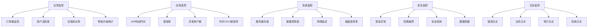

# 中道商城系统 - 监控日志与运维策略

**文档目的**：定义完整的系统监控、日志管理和运维策略
**适用范围**：系统运维、故障排查、性能优化、安全监控
**最后更新**：2025年11月18日
**版本**：1.0

---

## 🎯 监控体系架构

### 📊 监控层次结构



### 🔧 监控工具栈

#### 核心监控组件

```typescript
// 监控系统配置
interface MonitoringStack {
  // 指标收集
  metrics: {
    collection: 'Prometheus';      // 指标收集
    storage: 'Prometheus';         // 时序数据库
    visualization: 'Grafana';      // 可视化面板
  };

  // 日志管理
  logging: {
    collection: 'Filebeat';        // 日志收集
    processing: 'Logstash';        // 日志处理
    storage: 'Elasticsearch';      // 日志存储
    visualization: 'Kibana';       // 日志可视化
  };

  // 分布式追踪
  tracing: {
    instrumentation: 'OpenTelemetry'; // 追踪埋点
    collection: 'Jaeger';           // 追踪收集
    visualization: 'Jaeger UI';     // 追踪可视化
  };

  // 告警通知
  alerting: {
    engine: 'AlertManager';        // 告警引擎
    channels: ['Email', 'Wechat', 'SMS']; // 通知渠道
    escalation: 'PagerDuty';       // 告警升级
  };
}
```

---

## 📈 业务监控指标

### 🏪 核心业务指标

#### 用户相关指标

```typescript
// 用户监控指标定义
interface UserMetrics {
  // 用户增长
  userGrowth: {
    newUsersPerDay: number;        // 每日新增用户
    userRetentionRate: number;     // 用户留存率
    userChurnRate: number;         // 用户流失率
    activeUserCount: number;       // 活跃用户数
  };

  // 用户等级分布
  userLevelDistribution: {
    normal: number;                // 普通会员数量
    vip: number;                   // VIP会员数量
    star_1: number;                // 一星店长数量
    star_2: number;                // 二星店长数量
    star_3: number;                // 三星店长数量
    star_4: number;                // 四星店长数量
    star_5: number;                // 五星店长数量
    director: number;              // 董事数量
  };

  // 用户行为
  userBehavior: {
    loginFrequency: number;        // 登录频次
    averageSessionDuration: number; // 平均会话时长
    featureUsageRate: Record<string, number>; // 功能使用率
  };
}

// 用户等级升级监控
class UserLevelMonitoring {
  async trackUserUpgrades(): Promise<void> {
    const upgrades = await this.getUserUpgradesLast24h();

    // 记录升级统计
    for (const upgrade of upgrades) {
      this.metricsCollector.record('user_upgrade', {
        user_id: upgrade.userId,
        from_level: upgrade.fromLevel,
        to_level: upgrade.toLevel,
        upgrade_time: upgrade.createdAt,
        upgrade_duration: upgrade.processingDuration
      });
    }

    // 计算升级成功率
    const successRate = this.calculateUpgradeSuccessRate(upgrades);
    this.metricsCollector.gauge('user_upgrade_success_rate', successRate);

    // 如果成功率低于95%，触发告警
    if (successRate < 0.95) {
      this.alertManager.sendAlert({
        level: 'warning',
        message: `用户升级成功率过低: ${(successRate * 100).toFixed(2)}%`,
        metrics: { successRate, totalUpgrades: upgrades.length }
      });
    }
  }
}
```

#### 交易相关指标

```typescript
// 交易监控指标
interface TransactionMetrics {
  // 交易量
  transactionVolume: {
    dailyGMV: number;              // 每日成交总额
    dailyOrderCount: number;       // 每日订单数
    averageOrderValue: number;     // 平均订单金额
    conversionRate: number;        // 转化率
  };

  // 采购业务
  purchaseMetrics: {
    purchaseRequestCount: number;  // 采购请求数
    purchaseSuccessRate: number;   // 采购成功率
    averagePurchaseAmount: number; // 平均采购金额
    purchaseProcessingTime: number; // 采购处理时间
  };

  // 通券流转
  pointsFlowMetrics: {
    dailyTransferVolume: number;   // 每日转账量
    transferSuccessRate: number;   // 转账成功率
    rechargeVolume: number;        // 充值量
    withdrawVolume: number;        // 提现量
  };
}

// 交易监控实现
class TransactionMonitoring {
  async monitorTransactionHealth(): Promise<void> {
    const now = new Date();
    const last24h = new Date(now.getTime() - 24 * 60 * 60 * 1000);

    // 获取24小时内的交易数据
    const transactions = await this.getTransactions(last24h, now);

    // 计算关键指标
    const metrics = {
      totalAmount: transactions.reduce((sum, t) => sum + t.amount, 0),
      totalCount: transactions.length,
      successCount: transactions.filter(t => t.status === 'success').length,
      averageProcessingTime: this.calculateAverageProcessingTime(transactions)
    };

    // 记录指标
    this.metricsCollector.counter('transaction_total_count').inc(metrics.totalCount);
    this.metricsCollector.counter('transaction_total_amount').inc(metrics.totalAmount);
    this.metricsCollector.gauge('transaction_success_rate', metrics.successCount / metrics.totalCount);
    this.metricsCollector.gauge('transaction_processing_time', metrics.averageProcessingTime);

    // 异常检测
    if (metrics.successCount / metrics.totalCount < 0.98) {
      this.alertManager.sendAlert({
        level: 'critical',
        message: `交易成功率过低: ${((metrics.successCount / metrics.totalCount) * 100).toFixed(2)}%`,
        details: {
          successCount: metrics.successCount,
          totalCount: metrics.totalCount,
          period: 'last_24h'
        }
      });
    }
  }
}
```

### 🎯 业务健康度评分

```typescript
// 业务健康度评分系统
class BusinessHealthScorer {
  private readonly weights = {
    userGrowth: 0.2,              // 用户增长权重
    transactionHealth: 0.3,       // 交易健康权重
    systemPerformance: 0.3,       // 系统性能权重
    userSatisfaction: 0.2         // 用户满意度权重
  };

  async calculateHealthScore(): Promise<HealthScore> {
    const scores = await Promise.all([
      this.calculateUserGrowthScore(),
      this.calculateTransactionHealthScore(),
      this.calculateSystemPerformanceScore(),
      this.calculateUserSatisfactionScore()
    ]);

    const overallScore = Object.entries(this.weights).reduce((total, [key, weight]) => {
      return total + (scores[key] * weight);
    }, 0);

    return {
      overall: overallScore,
      breakdown: scores,
      level: this.getHealthLevel(overallScore),
      recommendations: this.getRecommendations(scores)
    };
  }

  private getHealthLevel(score: number): 'excellent' | 'good' | 'warning' | 'critical' {
    if (score >= 0.9) return 'excellent';
    if (score >= 0.75) return 'good';
    if (score >= 0.6) return 'warning';
    return 'critical';
  }
}

interface HealthScore {
  overall: number;
  breakdown: Record<string, number>;
  level: 'excellent' | 'good' | 'warning' | 'critical';
  recommendations: string[];
}
```

---

## 🖥️ 应用性能监控

### ⚡ API性能监控

#### 响应时间监控

```typescript
// API性能监控中间件
class ApiPerformanceMonitoring {
  // 性能指标收集
  middleware() {
    return (req: Request, res: Response, next: NextFunction) => {
      const startTime = Date.now();
      const requestId = req.headers['x-request-id'] as string || this.generateRequestId();

      // 记录请求开始
      this.logger.info('API request started', {
        requestId,
        method: req.method,
        url: req.url,
        userAgent: req.headers['user-agent'],
        userId: req.user?.id
      });

      // 监听响应结束
      res.on('finish', () => {
        const duration = Date.now() - startTime;
        const statusCode = res.statusCode;

        // 记录性能指标
        this.recordApiMetrics({
          requestId,
          method: req.method,
          url: req.url,
          statusCode,
          duration,
          userId: req.user?.id
        });

        // 记录请求完成日志
        this.logger.info('API request completed', {
          requestId,
          method: req.method,
          url: req.url,
          statusCode,
          duration,
          userId: req.user?.id
        });

        // 性能告警
        if (duration > 5000) { // 超过5秒
          this.alertManager.sendAlert({
            level: 'warning',
            message: `API响应时间过长: ${duration}ms`,
            details: {
              method: req.method,
              url: req.url,
              duration,
              requestId
            }
          });
        }
      });

      next();
    };
  }

  private recordApiMetrics(metrics: ApiMetrics): void {
    // 记录Prometheus指标
    this.metricsCollector
      .counter('api_requests_total')
      .inc({
        method: metrics.method,
        url: metrics.url,
        status_code: metrics.statusCode.toString()
      });

    this.metricsCollector
      .histogram('api_request_duration')
      .observe(metrics.duration, {
        method: metrics.method,
        url: metrics.url
      });

    // 记录慢查询
    if (metrics.duration > 2000) {
      this.slowQueryLogger.warn('Slow API request', metrics);
    }
  }
}

interface ApiMetrics {
  requestId: string;
  method: string;
  url: string;
  statusCode: number;
  duration: number;
  userId?: string;
}
```

#### 数据库性能监控

```typescript
// 数据库性能监控
class DatabaseMonitoring {
  async monitorDatabasePerformance(): Promise<void> {
    // 获取数据库连接状态
    const connectionStats = await this.getConnectionStats();

    // 记录连接池指标
    this.metricsCollector.gauge('db_connections_active', connectionStats.active);
    this.metricsCollector.gauge('db_connections_idle', connectionStats.idle);
    this.metricsCollector.gauge('db_connections_total', connectionStats.total);

    // 监控慢查询
    const slowQueries = await this.getSlowQueries();
    for (const query of slowQueries) {
      this.slowQueryLogger.error('Slow query detected', {
        query: query.query,
        duration: query.duration,
        timestamp: query.timestamp,
        parameters: query.parameters
      });

      this.metricsCollector.counter('db_slow_queries_total').inc({
        table: this.extractTableFromQuery(query.query)
      });
    }

    // 监控数据库锁等待
    const lockWaits = await this.getLockWaits();
    if (lockWaits.length > 0) {
      this.alertManager.sendAlert({
        level: 'warning',
        message: `检测到数据库锁等待: ${lockWaits.length}个`,
        details: lockWaits
      });
    }
  }

  async monitorTablePerformance(): Promise<void> {
    const tables = ['users', 'shops', 'purchase_orders', 'points_transactions'];

    for (const table of tables) {
      const stats = await this.getTableStats(table);

      // 记录表大小和行数
      this.metricsCollector.gauge(`db_table_size_bytes`, stats.sizeBytes, { table });
      this.metricsCollector.gauge(`db_table_rows`, stats.rowCount, { table });

      // 监控表索引效率
      if (stats.indexEfficiency < 0.9) {
        this.alertManager.sendAlert({
          level: 'warning',
          message: `表 ${table} 索引效率低: ${(stats.indexEfficiency * 100).toFixed(2)}%`,
          details: {
            table,
            indexEfficiency: stats.indexEfficiency,
            recommendation: '考虑重建或优化索引'
          }
        });
      }
    }
  }
}
```

### 💾 内存和CPU监控

```typescript
// 系统资源监控
class SystemResourceMonitoring {
  private readonly monitoringInterval = 60000; // 1分钟

  startMonitoring(): void {
    setInterval(() => {
      this.collectSystemMetrics();
    }, this.monitoringInterval);
  }

  private async collectSystemMetrics(): Promise<void> {
    const memUsage = process.memoryUsage();
    const cpuUsage = process.cpuUsage();

    // 记录内存使用情况
    this.metricsCollector.gauge('nodejs_memory_rss', memUsage.rss);
    this.metricsCollector.gauge('nodejs_memory_heap_used', memUsage.heapUsed);
    this.metricsCollector.gauge('nodejs_memory_heap_total', memUsage.heapTotal);
    this.metricsCollector.gauge('nodejs_memory_external', memUsage.external);

    // 计算内存使用率
    const heapUsageRatio = memUsage.heapUsed / memUsage.heapTotal;
    this.metricsCollector.gauge('nodejs_memory_usage_ratio', heapUsageRatio);

    // 内存告警
    if (heapUsageRatio > 0.9) {
      this.alertManager.sendAlert({
        level: 'critical',
        message: `内存使用率过高: ${(heapUsageRatio * 100).toFixed(2)}%`,
        details: {
          heapUsed: memUsage.heapUsed,
          heapTotal: memUsage.heapTotal,
          rss: memUsage.rss
        }
      });
    }

    // 检查内存泄漏
    if (heapUsageRatio > 0.8) {
      await this.checkMemoryLeak();
    }
  }

  private async checkMemoryLeak(): Promise<void> {
    // 强制垃圾回收（如果可用）
    if (global.gc) {
      global.gc();

      // 等待一段时间后再次检查
      setTimeout(async () => {
        const memUsage = process.memoryUsage();
        const heapUsageRatio = memUsage.heapUsed / memUsage.heapTotal;

        // 如果GC后内存使用率仍然很高，可能存在内存泄漏
        if (heapUsageRatio > 0.8) {
          this.alertManager.sendAlert({
            level: 'critical',
            message: '可能存在内存泄漏',
            details: {
              heapUsageRatio,
              heapUsed: memUsage.heapUsed,
              heapTotal: memUsage.heapTotal,
              recommendation: '建议检查代码并及时重启服务'
            }
          });
        }
      }, 5000);
    }
  }
}
```

---

## 📝 日志管理策略

### 🗂️ 日志分类和格式

#### 日志级别定义

```typescript
// 日志级别和格式定义
enum LogLevel {
  ERROR = 'error',      // 错误：系统错误、异常
  WARN = 'warn',        // 警告：潜在问题
  INFO = 'info',        // 信息：重要业务操作
  DEBUG = 'debug',      // 调试：详细调试信息
  TRACE = 'trace'       // 追踪：最详细信息
}

// 标准日志格式
interface LogEntry {
  timestamp: string;              // ISO 8601 时间戳
  level: LogLevel;                // 日志级别
  service: string;                // 服务名称
  requestId?: string;             // 请求ID
  userId?: string;                // 用户ID
  message: string;                // 日志消息
  data?: Record<string, any>;     // 结构化数据
  error?: {                       // 错误信息
    name: string;
    message: string;
    stack?: string;
  };
  tags?: string[];                // 标签
  duration?: number;              // 操作耗时(ms)
}
```

#### 业务日志规范

```typescript
// 用户操作日志
class UserActivityLogger {
  logUserLogin(userId: string, deviceInfo: DeviceInfo, success: boolean): void {
    this.logger.info('User login attempt', {
      userId,
      success,
      deviceInfo,
      timestamp: new Date().toISOString(),
      category: 'user_activity',
      action: 'login'
    });
  }

  logUserUpgrade(userId: string, fromLevel: string, toLevel: string, duration: number): void {
    this.logger.info('User level upgrade', {
      userId,
      fromLevel,
      toLevel,
      duration,
      timestamp: new Date().toISOString(),
      category: 'user_activity',
      action: 'level_upgrade'
    });
  }

  logPurchaseOrder(buyerId: string, sellerId: string, amount: number, status: string): void {
    this.logger.info('Purchase order created', {
      buyerId,
      sellerId,
      amount,
      status,
      timestamp: new Date().toISOString(),
      category: 'business_transaction',
      action: 'purchase_order'
    });
  }
}

// 安全审计日志
class SecurityAuditLogger {
  logPermissionCheck(userId: string, resource: string, action: string, granted: boolean): void {
    this.logger.info('Permission check', {
      userId,
      resource,
      action,
      granted,
      timestamp: new Date().toISOString(),
      category: 'security_audit',
      action: 'permission_check'
    });

    // 记录权限拒绝
    if (!granted) {
      this.alertManager.sendAlert({
        level: 'warning',
        message: `权限拒绝: 用户 ${userId} 尝试访问 ${resource}/${action}`,
        details: { userId, resource, action }
      });
    }
  }

  logSuspiciousActivity(userId: string, activity: string, details: Record<string, any>): void {
    this.logger.warn('Suspicious activity detected', {
      userId,
      activity,
      details,
      timestamp: new Date().toISOString(),
      category: 'security_audit',
      action: 'suspicious_activity'
    });

    this.alertManager.sendAlert({
      level: 'high',
      message: `检测到可疑活动: ${activity}`,
      details: { userId, activity, details }
    });
  }
}
```

### 🔍 日志查询和分析

#### 日志查询接口

```typescript
// 日志查询服务
class LogQueryService {
  // 根据用户ID查询操作日志
  async getUserActivityLogs(
    userId: string,
    options: {
      startDate?: Date;
      endDate?: Date;
      actions?: string[];
      limit?: number;
      offset?: number;
    }
  ): Promise<LogEntry[]> {
    const query = {
      bool: {
        must: [
          { term: { userId } },
          { term: { category: 'user_activity' } }
        ]
      }
    };

    if (options.startDate || options.endDate) {
      query.bool.must.push({
        range: {
          timestamp: {
            gte: options.startDate?.toISOString(),
            lte: options.endDate?.toISOString()
          }
        }
      });
    }

    if (options.actions?.length) {
      query.bool.must.push({
        terms: { action: options.actions }
      });
    }

    const result = await this.elasticsearch.search({
      index: 'zhongdao-mall-logs-*',
      body: {
        query,
        sort: [{ timestamp: { order: 'desc' } }],
        size: options.limit || 100,
        from: options.offset || 0
      }
    });

    return result.body.hits.hits.map(hit => hit._source);
  }

  // 查询错误日志
  async getErrorLogs(options: {
    startDate?: Date;
    endDate?: Date;
    service?: string;
    level?: LogLevel;
    search?: string;
  }): Promise<LogEntry[]> {
    const query = {
      bool: {
        must: [
          { term: { level: options.level || 'error' } }
        ]
      }
    };

    if (options.service) {
      query.bool.must.push({ term: { service: options.service } });
    }

    if (options.search) {
      query.bool.must.push({
        multi_match: {
          query: options.search,
          fields: ['message', 'error.message']
        }
      });
    }

    if (options.startDate || options.endDate) {
      query.bool.must.push({
        range: {
          timestamp: {
            gte: options.startDate?.toISOString(),
            lte: options.endDate?.toISOString()
          }
        }
      });
    }

    const result = await this.elasticsearch.search({
      index: 'zhongdao-mall-logs-*',
      body: {
        query,
        sort: [{ timestamp: { order: 'desc' } }],
        size: 100
      }
    });

    return result.body.hits.hits.map(hit => hit._source);
  }

  // 获取日志统计信息
  async getLogStatistics(options: {
    startDate: Date;
    endDate: Date;
    interval?: 'hour' | 'day' | 'week';
  }): Promise<LogStatistics> {
    const interval = options.interval || 'day';

    const aggregationQuery = {
      aggs: {
        logs_over_time: {
          date_histogram: {
            field: 'timestamp',
            calendar_interval: interval
          }
        },
        logs_by_level: {
          terms: {
            field: 'level'
          }
        },
        logs_by_service: {
          terms: {
            field: 'service'
          }
        }
      }
    };

    const result = await this.elasticsearch.search({
      index: 'zhongdao-mall-logs-*',
      body: {
        query: {
          range: {
            timestamp: {
              gte: options.startDate.toISOString(),
              lte: options.endDate.toISOString()
            }
          }
        },
        aggs: aggregationQuery.aggs,
        size: 0
      }
    });

    return this.parseAggregationResult(result.body.aggregations);
  }
}

interface LogStatistics {
  totalLogs: number;
  timeSeries: Array<{
    timestamp: string;
    count: number;
  }>;
  byLevel: Record<string, number>;
  byService: Record<string, number>;
}
```

---

## 🚨 告警策略

### 📊 告警级别定义

```typescript
// 告警级别配置
enum AlertLevel {
  CRITICAL = 'critical',    // 严重：系统不可用、数据丢失风险
  HIGH = 'high',           // 高：功能异常、性能严重下降
  WARNING = 'warning',     // 警告：潜在问题、需要关注
  INFO = 'info'           // 信息：一般通知、状态更新
}

// 告警规则定义
interface AlertRule {
  name: string;                    // 规则名称
  description: string;             // 规则描述
  level: AlertLevel;               // 告警级别
  condition: string;               // 触发条件
  threshold: number;               // 阈值
  duration: number;                // 持续时间(秒)
  labels: Record<string, string>;  // 标签
  annotations: Record<string, string>; // 注释
}
```

### 🎯 告警规则配置

#### 业务告警规则

```yaml
# prometheus-rules.yml
groups:
  - name: business-alerts
    rules:
      # 用户升级失败率过高
      - alert: UserUpgradeFailureRate
        expr: rate(user_upgrade_failures_total[5m]) / rate(user_upgrade_attempts_total[5m]) > 0.1
        for: 2m
        labels:
          severity: high
          team: business
        annotations:
          summary: "用户升级失败率过高"
          description: "过去5分钟用户升级失败率: {{ $value | humanizePercentage }}"

      # 交易成功率过低
      - alert: TransactionSuccessRateLow
        expr: rate(transaction_success_total[5m]) / rate(transaction_attempts_total[5m]) < 0.95
        for: 1m
        labels:
          severity: critical
          team: business
        annotations:
          summary: "交易成功率过低"
          description: "过去5分钟交易成功率: {{ $value | humanizePercentage }}"

      # 通券转账失败
      - alert: PointsTransferFailures
        expr: rate(points_transfer_failures_total[5m]) > 0.1
        for: 2m
        labels:
          severity: high
          team: finance
        annotations:
          summary: "通券转账失败率过高"
          description: "过去5分钟通券转账失败次数: {{ $value }}"

  - name: system-alerts
    rules:
      # API响应时间过长
      - alert: HighApiResponseTime
        expr: histogram_quantile(0.95, rate(http_request_duration_seconds_bucket[5m])) > 2
        for: 3m
        labels:
          severity: warning
          team: backend
        annotations:
          summary: "API响应时间过长"
          description: "95分位响应时间: {{ $value }}s"

      # 错误率过高
      - alert: HighErrorRate
        expr: rate(http_requests_total{status=~"5.."}[5m]) / rate(http_requests_total[5m]) > 0.05
        for: 2m
        labels:
          severity: high
          team: backend
        annotations:
          summary: "API错误率过高"
          description: "过去5分钟错误率: {{ $value | humanizePercentage }}"

      # 内存使用率过高
      - alert: HighMemoryUsage
        expr: nodejs_memory_usage_ratio > 0.9
        for: 5m
        labels:
          severity: critical
          team: ops
        annotations:
          summary: "内存使用率过高"
          description: "内存使用率: {{ $value | humanizePercentage }}"

      # 数据库连接池耗尽
      - alert: DatabaseConnectionPoolExhausted
        expr: db_connections_active / db_connections_total > 0.9
        for: 1m
        labels:
          severity: critical
          team: ops
        annotations:
          summary: "数据库连接池即将耗尽"
          description: "活跃连接数: {{ $value }}"
```

### 📢 告警通知配置

#### 告警通知服务

```typescript
// 告警通知服务
class AlertNotificationService {
  private readonly notificationChannels = {
    email: new EmailNotifier(),
    wechat: new WechatNotifier(),
    sms: new SmsNotifier(),
    slack: new SlackNotifier()
  };

  async sendAlert(alert: Alert): Promise<void> {
    // 根据告警级别选择通知渠道
    const channels = this.getNotificationChannels(alert.level);

    // 构建通知消息
    const message = this.buildAlertMessage(alert);

    // 并发发送通知
    await Promise.allSettled(
      channels.map(channel => this.sendNotification(channel, alert, message))
    );

    // 记录告警日志
    this.logger.warn('Alert sent', {
      alertId: alert.id,
      level: alert.level,
      name: alert.name,
      channels: channels.map(c => c.constructor.name)
    });
  }

  private getNotificationChannels(level: AlertLevel): Notifier[] {
    switch (level) {
      case AlertLevel.CRITICAL:
        return [
          this.notificationChannels.email,
          this.notificationChannels.wechat,
          this.notificationChannels.sms,
          this.notificationChannels.slack
        ];
      case AlertLevel.HIGH:
        return [
          this.notificationChannels.email,
          this.notificationChannels.wechat,
          this.notificationChannels.slack
        ];
      case AlertLevel.WARNING:
        return [this.notificationChannels.email, this.notificationChannels.slack];
      case AlertLevel.INFO:
        return [this.notificationChannels.slack];
      default:
        return [];
    }
  }

  private buildAlertMessage(alert: Alert): string {
    return `
🚨 **${alert.level.toUpperCase()}** 告警

**告警名称**: ${alert.name}
**告警描述**: ${alert.description}
**触发时间**: ${alert.timestamp}
**持续时间**: ${alert.duration}秒

**详细信息**:
${alert.details ? JSON.stringify(alert.details, null, 2) : '无'}

**建议操作**:
${alert.recommendations?.join('\n') || '请联系相关团队处理'}

---
*此告警由中道商城监控系统自动发出*
    `.trim();
  }
}

interface Alert {
  id: string;
  level: AlertLevel;
  name: string;
  description: string;
  timestamp: string;
  duration: number;
  details?: Record<string, any>;
  recommendations?: string[];
}
```

---

## 🛠️ 运维自动化

### 🔄 自动化部署

#### CI/CD流水线

```yaml
# .github/workflows/deploy.yml
name: Deploy to Production

on:
  push:
    branches: [main]
  pull_request:
    branches: [main]

jobs:
  test:
    runs-on: ubuntu-latest
    steps:
      - uses: actions/checkout@v3
      - uses: actions/setup-node@v3
        with:
          node-version: '18'
          cache: 'npm'

      - name: Install dependencies
        run: npm ci

      - name: Run tests
        run: npm test

      - name: Run integration tests
        run: npm run test:integration

      - name: Upload coverage
        uses: codecov/codecov-action@v3

  security-scan:
    runs-on: ubuntu-latest
    steps:
      - uses: actions/checkout@v3
      - name: Run security audit
        run: npm audit --audit-level moderate

      - name: Run Snyk security scan
        uses: snyk/actions/node@master
        env:
          SNYK_TOKEN: ${{ secrets.SNYK_TOKEN }}

  build:
    needs: [test, security-scan]
    runs-on: ubuntu-latest
    steps:
      - uses: actions/checkout@v3

      - name: Build Docker image
        run: |
          docker build -t zhongdao-mall:${{ github.sha }} .
          docker tag zhongdao-mall:${{ github.sha }} zhongdao-mall:latest

      - name: Push to registry
        if: github.ref == 'refs/heads/main'
        run: |
          echo ${{ secrets.DOCKER_PASSWORD }} | docker login -u ${{ secrets.DOCKER_USERNAME }} --password-stdin
          docker push zhongdao-mall:${{ github.sha }}
          docker push zhongdao-mall:latest

  deploy-staging:
    needs: build
    runs-on: ubuntu-latest
    if: github.ref == 'refs/heads/main'
    steps:
      - name: Deploy to staging
        run: |
          # 部署到测试环境
          ssh deploy@staging.zhongdao-mall.com "
            docker pull zhongdao-mall:latest
            docker-compose -f docker-compose.staging.yml up -d
          "

      - name: Run smoke tests
        run: |
          # 运行冒烟测试
          npm run test:smoke -- --baseUrl=https://staging.zhongdao-mall.com

  deploy-production:
    needs: deploy-staging
    runs-on: ubuntu-latest
    if: github.ref == 'refs/heads/main'
    steps:
      - name: Deploy to production
        run: |
          # 蓝绿部署到生产环境
          ssh deploy@prod.zhongdao-mall.com "
            ./scripts/blue-green-deploy.sh zhongdao-mall:latest
          "

      - name: Post-deployment health check
        run: |
          # 部署后健康检查
          ./scripts/health-check.sh https://api.zhongdao-mall.com
```

### 🔧 自动化运维脚本

#### 健康检查脚本

```bash
#!/bin/bash
# scripts/health-check.sh

set -e

API_BASE_URL=${1:-"http://localhost:3000"}
TIMEOUT=30
MAX_RETRIES=3

# 颜色定义
RED='\033[0;31m'
GREEN='\033[0;32m'
YELLOW='\033[1;33m'
NC='\033[0m' # No Color

log_info() {
    echo -e "${GREEN}[INFO]${NC} $1"
}

log_warn() {
    echo -e "${YELLOW}[WARN]${NC} $1"
}

log_error() {
    echo -e "${RED}[ERROR]${NC} $1"
}

# 检查API健康状态
check_api_health() {
    log_info "检查API健康状态..."

    for i in $(seq 1 $MAX_RETRIES); do
        if curl -f -s --max-time $TIMEOUT "$API_BASE_URL/health" > /dev/null; then
            log_info "✅ API健康检查通过"
            return 0
        else
            log_warn "❌ 第${i}次健康检查失败"
            if [ $i -lt $MAX_RETRIES ]; then
                sleep 5
            fi
        fi
    done

    log_error "🚨 API健康检查失败，服务可能不可用"
    return 1
}

# 检查数据库连接
check_database_connection() {
    log_info "检查数据库连接..."

    if curl -f -s --max-time $TIMEOUT "$API_BASE_URL/health/database" > /dev/null; then
        log_info "✅ 数据库连接正常"
        return 0
    else
        log_error "❌ 数据库连接失败"
        return 1
    fi
}

# 检查Redis连接
check_redis_connection() {
    log_info "检查Redis连接..."

    if curl -f -s --max-time $TIMEOUT "$API_BASE_URL/health/redis" > /dev/null; then
        log_info "✅ Redis连接正常"
        return 0
    else
        log_error "❌ Redis连接失败"
        return 1
    fi
}

# 检查关键业务接口
check_business_endpoints() {
    log_info "检查关键业务接口..."

    endpoints=(
        "/api/v1/users/health"
        "/api/v1/shops/health"
        "/api/v1/purchases/health"
        "/api/v1/points/health"
    )

    for endpoint in "${endpoints[@]}"; do
        if curl -f -s --max-time $TIMEOUT "$API_BASE_URL$endpoint" > /dev/null; then
            log_info "✅ $endpoint 正常"
        else
            log_error "❌ $endpoint 异常"
            return 1
        fi
    done
}

# 主检查流程
main() {
    log_info "开始系统健康检查..."
    log_info "目标地址: $API_BASE_URL"

    failed_checks=0

    check_api_health || ((failed_checks++))
    check_database_connection || ((failed_checks++))
    check_redis_connection || ((failed_checks++))
    check_business_endpoints || ((failed_checks++))

    if [ $failed_checks -eq 0 ]; then
        log_info "🎉 所有健康检查通过！"
        exit 0
    else
        log_error "💥 有 $failed_checks 项检查失败"
        exit 1
    fi
}

main "$@"
```

#### 自动备份脚本

```bash
#!/bin/bash
# scripts/backup.sh

set -e

# 配置
BACKUP_DIR="/backup/zhongdao-mall"
DATE=$(date +%Y%m%d_%H%M%S)
RETENTION_DAYS=7

# 颜色定义
RED='\033[0;31m'
GREEN='\033[0;32m'
YELLOW='\033[1;33m'
NC='\033[0m'

log_info() {
    echo -e "${GREEN}[INFO]${NC} $1"
}

log_warn() {
    echo -e "${YELLOW}[WARN]${NC} $1"
}

log_error() {
    echo -e "${RED}[ERROR]${NC} $1"
}

# 备份数据库
backup_database() {
    log_info "开始备份数据库..."

    local backup_file="$BACKUP_DIR/database/zhongdao_mall_$DATE.sql"

    mkdir -p "$(dirname "$backup_file")"

    # 使用mysqldump备份数据库
    mysqldump \
        --single-transaction \
        --routines \
        --triggers \
        --all-databases \
        --host="$DB_HOST" \
        --user="$DB_USER" \
        --password="$DB_PASSWORD" \
        --result-file="$backup_file"

    # 压缩备份文件
    gzip "$backup_file"

    log_info "✅ 数据库备份完成: ${backup_file}.gz"
}

# 备份文件存储
backup_files() {
    log_info "开始备份文件存储..."

    local backup_dir="$BACKUP_DIR/files_$DATE"

    # 备份上传的文件
    if [ -d "/app/uploads" ]; then
        mkdir -p "$backup_dir/uploads"
        rsync -av --delete /app/uploads/ "$backup_dir/uploads/"
        log_info "✅ 文件备份完成: $backup_dir"
    fi

    # 备份配置文件
    mkdir -p "$backup_dir/config"
    cp /app/.env "$backup_dir/config/" 2>/dev/null || log_warn "未找到.env文件"
    cp -r /app/config "$backup_dir/config/" 2>/dev/null || log_warn "未找到config目录"
}

# 备份日志文件
backup_logs() {
    log_info "开始备份日志文件..."

    local backup_dir="$BACKUP_DIR/logs_$DATE"

    if [ -d "/app/logs" ]; then
        mkdir -p "$backup_dir"
        rsync -av --delete /app/logs/ "$backup_dir/"
        log_info "✅ 日志备份完成: $backup_dir"
    else
        log_warn "未找到日志目录"
    fi
}

# 清理过期备份
cleanup_old_backups() {
    log_info "清理 $RETENTION_DAYS 天前的备份..."

    # 清理数据库备份
    find "$BACKUP_DIR/database" -name "*.sql.gz" -mtime +$RETENTION_DAYS -delete

    # 清理文件备份
    find "$BACKUP_DIR" -name "files_*" -mtime +$RETENTION_DAYS -exec rm -rf {} +

    # 清理日志备份
    find "$BACKUP_DIR" -name "logs_*" -mtime +$RETENTION_DAYS -exec rm -rf {} +

    log_info "✅ 过期备份清理完成"
}

# 验证备份完整性
verify_backup() {
    log_info "验证备份完整性..."

    # 验证数据库备份
    local db_backup=$(find "$BACKUP_DIR/database" -name "*$DATE*.sql.gz" | head -1)
    if [ -n "$db_backup" ]; then
        if gzip -t "$db_backup" 2>/dev/null; then
            log_info "✅ 数据库备份文件完整"
        else
            log_error "❌ 数据库备份文件损坏"
            return 1
        fi
    fi

    log_info "✅ 备份验证完成"
}

# 上传到云存储
upload_to_cloud() {
    if [ -n "$CLOUD_STORAGE_BUCKET" ]; then
        log_info "上传备份到云存储..."

        # 使用AWS S3作为示例
        for backup in "$BACKUP_DIR"/*"$DATE"*; do
            if [ -d "$backup" ]; then
                tar -czf "${backup}.tar.gz" -C "$(dirname "$backup")" "$(basename "$backup")"
                aws s3 cp "${backup}.tar.gz" "s3://$CLOUD_STORAGE_BUCKET/"
            elif [ -f "$backup" ]; then
                aws s3 cp "$backup" "s3://$CLOUD_STORAGE_BUCKET/"
            fi
        done

        log_info "✅ 云存储上传完成"
    fi
}

# 主备份流程
main() {
    log_info "开始系统备份..."
    log_info "备份时间: $DATE"

    # 创建备份目录
    mkdir -p "$BACKUP_DIR"/{database,files,logs}

    # 执行备份
    backup_database
    backup_files
    backup_logs

    # 验证备份
    verify_backup

    # 上传到云存储
    upload_to_cloud

    # 清理过期备份
    cleanup_old_backups

    log_info "🎉 系统备份完成！"
}

main "$@"
```

---

## 📊 监控面板配置

### 📈 Grafana仪表板

#### 业务监控面板

```json
{
  "dashboard": {
    "title": "中道商城 - 业务监控",
    "tags": ["business", "zhongdao-mall"],
    "timezone": "browser",
    "panels": [
      {
        "title": "用户增长趋势",
        "type": "graph",
        "targets": [
          {
            "expr": "increase(user_registration_total[1h])",
            "legendFormat": "新增用户"
          },
          {
            "expr": "user_active_total",
            "legendFormat": "活跃用户"
          }
        ]
      },
      {
        "title": "用户等级分布",
        "type": "piechart",
        "targets": [
          {
            "expr": "user_level_total",
            "legendFormat": "{{level}}"
          }
        ]
      },
      {
        "title": "交易统计",
        "type": "stat",
        "targets": [
          {
            "expr": "increase(transaction_amount_total[1h])",
            "legendFormat": "小时交易额"
          },
          {
            "expr": "increase(transaction_count_total[1h])",
            "legendFormat": "小时订单数"
          }
        ]
      },
      {
        "title": "用户升级成功率",
        "type": "stat",
        "targets": [
          {
            "expr": "rate(user_upgrade_success_total[5m]) / rate(user_upgrade_attempt_total[5m])",
            "legendFormat": "升级成功率"
          }
        ],
        "fieldConfig": {
          "defaults": {
            "unit": "percentunit",
            "thresholds": {
              "steps": [
                {"color": "red", "value": 0},
                {"color": "yellow", "value": 0.8},
                {"color": "green", "value": 0.95}
              ]
            }
          }
        }
      }
    ]
  }
}
```

#### 系统性能面板

```json
{
  "dashboard": {
    "title": "中道商城 - 系统性能",
    "tags": ["system", "performance"],
    "panels": [
      {
        "title": "API响应时间",
        "type": "graph",
        "targets": [
          {
            "expr": "histogram_quantile(0.50, rate(http_request_duration_seconds_bucket[5m]))",
            "legendFormat": "50分位"
          },
          {
            "expr": "histogram_quantile(0.95, rate(http_request_duration_seconds_bucket[5m]))",
            "legendFormat": "95分位"
          },
          {
            "expr": "histogram_quantile(0.99, rate(http_request_duration_seconds_bucket[5m]))",
            "legendFormat": "99分位"
          }
        ]
      },
      {
        "title": "错误率",
        "type": "graph",
        "targets": [
          {
            "expr": "rate(http_requests_total{status=~\"5..\"}[5m]) / rate(http_requests_total[5m])",
            "legendFormat": "5xx错误率"
          },
          {
            "expr": "rate(http_requests_total{status=~\"4..\"}[5m]) / rate(http_requests_total[5m])",
            "legendFormat": "4xx错误率"
          }
        ]
      },
      {
        "title": "内存使用情况",
        "type": "graph",
        "targets": [
          {
            "expr": "nodejs_memory_usage_ratio",
            "legendFormat": "内存使用率"
          },
          {
            "expr": "nodejs_memory_heap_used / 1024 / 1024",
            "legendFormat": "堆内存使用(MB)"
          }
        ]
      },
      {
        "title": "数据库性能",
        "type": "graph",
        "targets": [
          {
            "expr": "db_connections_active",
            "legendFormat": "活跃连接数"
          },
          {
            "expr": "rate(db_slow_queries_total[5m])",
            "legendFormat": "慢查询率"
          }
        ]
      }
    ]
  }
}
```

---

## 📋 运维检查清单

### 🌅 日常运维检查

#### 每日检查项目
- [ ] 系统健康状态检查
- [ ] 业务指标正常性检查
- [ ] 错误日志审查
- [ ] 告警信息处理
- [ ] 备份任务执行状态
- [ ] 性能指标趋势分析

#### 每周检查项目
- [ ] 系统性能报告分析
- [ ] 安全漏洞扫描
- [ ] 日志清理归档
- [ ] 监控规则优化
- [ ] 容量规划评估
- [ ] 文档更新维护

#### 每月检查项目
- [ ] 灾备演练测试
- [ ] 性能基准测试
- [ ] 安全审计
- [ ] 监控系统维护
- [ ] 运维流程优化
- [ ] 团队培训计划

### 🚨 应急响应流程

#### 故障响应等级

**P0 - 严重故障**
- 系统完全不可用
- 数据丢失风险
- 响应时间：< 15分钟
- 解决时间：< 2小时

**P1 - 重要故障**
- 核心功能异常
- 性能严重下降
- 响应时间：< 30分钟
- 解决时间：< 4小时

**P2 - 一般故障**
- 部分功能异常
- 性能轻微下降
- 响应时间：< 1小时
- 解决时间：< 8小时

**P3 - 低优先级**
- 用户体验影响
- 非核心功能问题
- 响应时间：< 4小时
- 解决时间：< 24小时

---

**重要提醒**：
1. 监控是系统的眼睛，必须覆盖所有关键指标
2. 日志是排查的依据，必须完整、准确、可查询
3. 告警是响应的信号，必须及时、准确、有效
4. 自动化是运维的保障，必须持续优化和改进
5. 文档是知识的载体，必须及时更新和分享

**通过完善的监控日志体系，我们将确保中道商城系统的稳定运行和快速故障恢复！** 🛡️