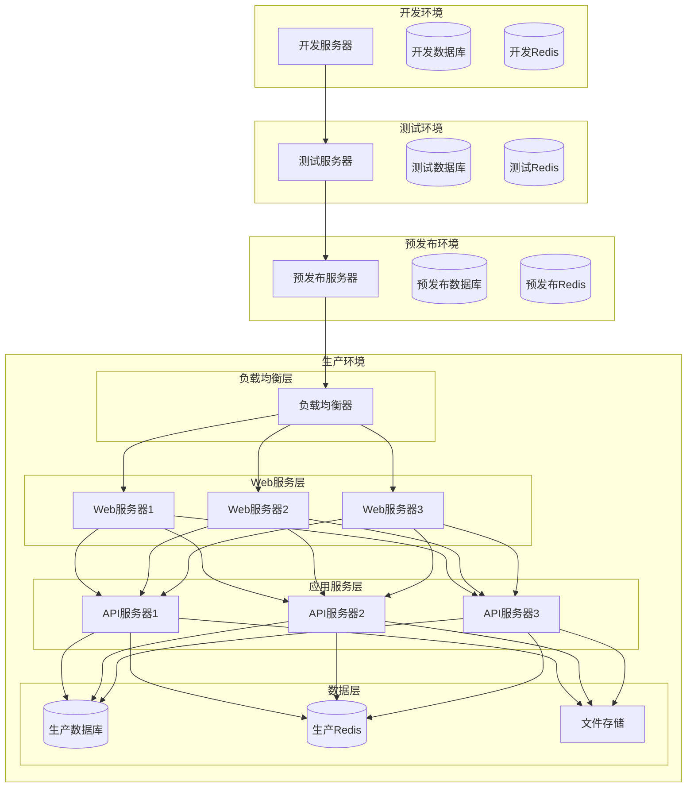
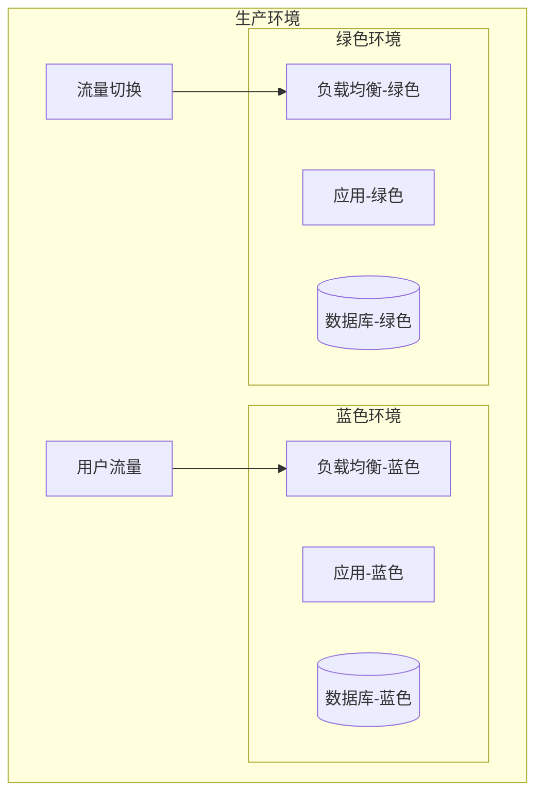

# 中道商城系统 - 部署发布策略

**文档目的**：定义完整的系统部署、发布和回滚策略
**适用范围**：生产环境部署、版本发布、应急回滚
**最后更新**：2025年11月18日
**版本**：1.0

---

## 🎯 部署架构设计

### 🏗️ 部署环境拓扑



### 🐳 容器化部署架构

```yaml
# docker-compose.prod.yml
version: '3.8'

services:
  # 负载均衡器
  nginx:
    image: nginx:alpine
    ports:
      - "80:80"
      - "443:443"
    volumes:
      - ./nginx/nginx.conf:/etc/nginx/nginx.conf
      - ./nginx/ssl:/etc/nginx/ssl
      - ./logs/nginx:/var/log/nginx
    depends_on:
      - api
    restart: unless-stopped
    networks:
      - frontend
      - backend

  # API服务
  api:
    image: zhongdao-mall:${VERSION}
    environment:
      - NODE_ENV=production
      - DATABASE_URL=${DATABASE_URL}
      - REDIS_URL=${REDIS_URL}
      - JWT_SECRET=${JWT_SECRET}
    volumes:
      - ./logs/app:/app/logs
      - ./uploads:/app/uploads
    depends_on:
      - mysql
      - redis
    restart: unless-stopped
    networks:
      - backend
    deploy:
      replicas: 3
      resources:
        limits:
          cpus: '1.0'
          memory: 1G
        reservations:
          cpus: '0.5'
          memory: 512M

  # 数据库
  mysql:
    image: mysql:8.0
    environment:
      - MYSQL_ROOT_PASSWORD=${DB_ROOT_PASSWORD}
      - MYSQL_DATABASE=${DB_NAME}
      - MYSQL_USER=${DB_USER}
      - MYSQL_PASSWORD=${DB_PASSWORD}
    volumes:
      - mysql_data:/var/lib/mysql
      - ./mysql/my.cnf:/etc/mysql/my.cnf
      - ./backup/mysql:/backup
    ports:
      - "3306:3306"
    restart: unless-stopped
    networks:
      - backend
    command: --default-authentication-plugin=mysql_native_password

  # Redis缓存
  redis:
    image: redis:7-alpine
    command: redis-server --appendonly yes --requirepass ${REDIS_PASSWORD}
    volumes:
      - redis_data:/data
      - ./redis/redis.conf:/etc/redis/redis.conf
    ports:
      - "6379:6379"
    restart: unless-stopped
    networks:
      - backend

  # 文件存储
  minio:
    image: minio/minio
    command: server /data --console-address ":9001"
    environment:
      - MINIO_ROOT_USER=${MINIO_ROOT_USER}
      - MINIO_ROOT_PASSWORD=${MINIO_ROOT_PASSWORD}
    volumes:
      - minio_data:/data
    ports:
      - "9000:9000"
      - "9001:9001"
    restart: unless-stopped
    networks:
      - backend

  # 监控
  prometheus:
    image: prom/prometheus
    ports:
      - "9090:9090"
    volumes:
      - ./monitoring/prometheus.yml:/etc/prometheus/prometheus.yml
      - prometheus_data:/prometheus
    restart: unless-stopped
    networks:
      - monitoring

  grafana:
    image: grafana/grafana
    ports:
      - "3001:3000"
    environment:
      - GF_SECURITY_ADMIN_PASSWORD=${GRAFANA_PASSWORD}
    volumes:
      - grafana_data:/var/lib/grafana
      - ./monitoring/grafana:/etc/grafana/provisioning
    restart: unless-stopped
    networks:
      - monitoring

volumes:
  mysql_data:
  redis_data:
  minio_data:
  prometheus_data:
  grafana_data:

networks:
  frontend:
    driver: bridge
  backend:
    driver: bridge
  monitoring:
    driver: bridge
```

---

## 🚀 部署策略

### 🔄 蓝绿部署

#### 蓝绿部署架构



#### 蓝绿部署脚本

```bash
#!/bin/bash
# scripts/blue-green-deploy.sh

set -e

# 配置
IMAGE_TAG=${1:-"latest"}
APP_NAME="zhongdao-mall"
BLUE_PORT=3000
GREEN_PORT=3001
HEALTH_CHECK_URL="http://localhost"
HEALTH_CHECK_TIMEOUT=60

# 颜色定义
RED='\033[0;31m'
GREEN='\033[0;32m'
YELLOW='\033[1;33m'
BLUE='\033[0;34m'
NC='\033[0m'

log_info() {
    echo -e "${GREEN}[INFO]${NC} $1"
}

log_warn() {
    echo -e "${YELLOW}[WARN]${NC} $1"
}

log_error() {
    echo -e "${RED}[ERROR]${NC} $1"
}

log_blue() {
    echo -e "${BLUE}[BLUE]${NC} $1"
}

log_green() {
    echo -e "${GREEN}[GREEN]${NC} $1"
}

# 获取当前活跃环境
get_active_environment() {
    if curl -f -s "$HEALTH_CHECK_URL:$BLUE_PORT/health" > /dev/null 2>&1; then
        echo "blue"
    elif curl -f -s "$HEALTH_CHECK_URL:$GREEN_PORT/health" > /dev/null 2>&1; then
        echo "green"
    else
        echo "none"
    fi
}

# 获取非活跃环境
get_inactive_environment() {
    local active=$(get_active_environment)
    if [ "$active" = "blue" ]; then
        echo "green"
    elif [ "$active" = "green" ]; then
        echo "blue"
    else
        echo "blue"  # 默认使用蓝色作为初始环境
    fi
}

# 健康检查
health_check() {
    local port=$1
    local timeout=$2

    log_info "开始健康检查 (端口: $port, 超时: ${timeout}s)..."

    for i in $(seq 1 $timeout); do
        if curl -f -s "$HEALTH_CHECK_URL:$port/health" > /dev/null 2>&1; then
            log_info "✅ 健康检查通过"
            return 0
        fi
        sleep 1
    done

    log_error "❌ 健康检查失败"
    return 1
}

# 数据库同步
sync_database() {
    local from_env=$1
    local to_env=$2

    log_info "同步数据库数据: $from_env -> $to_env"

    # 这里实现数据库同步逻辑
    # 注意：对于读多写少的应用，可以考虑主从复制
    # 对于写操作频繁的应用，需要实现数据双写策略

    log_info "✅ 数据库同步完成"
}

# 部署到指定环境
deploy_to_environment() {
    local environment=$1
    local port=$2

    log_info "部署到 $environment 环境 (端口: $port)..."

    # 停止旧容器
    if docker ps -q -f name="$APP_NAME-$environment" | grep -q .; then
        log_info "停止旧的 $environment 容器..."
        docker stop "$APP_NAME-$environment" || true
        docker rm "$APP_NAME-$environment" || true
    fi

    # 启动新容器
    log_info "启动新的 $environment 容器..."
    docker run -d \
        --name "$APP_NAME-$environment" \
        --network host \
        -e NODE_ENV=production \
        -e PORT=$port \
        -e DATABASE_URL="$DATABASE_URL" \
        -e REDIS_URL="$REDIS_URL" \
        -v "$(pwd)/logs:/app/logs" \
        -v "$(pwd)/uploads:/app/uploads" \
        "$APP_NAME:$IMAGE_TAG"

    log_info "✅ $environment 环境部署完成"
}

# 流量切换
switch_traffic() {
    local from_env=$1
    local to_env=$2
    local from_port=$3
    local to_port=$4

    log_info "切换流量: $from_env -> $to_env"

    # 更新负载均衡器配置
    cat > nginx/upstream.conf << EOF
upstream zhongdao_mall {
    server 127.0.0.1:$to_port;
    # 保留旧环境作为备份
    server 127.0.0.1:$from_port backup;
}
EOF

    # 重新加载Nginx配置
    docker exec nginx nginx -s reload

    log_info "✅ 流量切换完成"
}

# 验证部署
verify_deployment() {
    local environment=$1
    local port=$2

    log_info "验证 $environment 环境部署..."

    # 健康检查
    if ! health_check $port 30; then
        log_error "健康检查失败，部署验证不通过"
        return 1
    fi

    # 业务功能检查
    log_info "执行业务功能检查..."

    # 检查用户登录
    if ! curl -f -s -X POST "$HEALTH_CHECK_URL:$port/api/v1/auth/health" > /dev/null 2>&1; then
        log_error "用户登录功能检查失败"
        return 1
    fi

    # 检查商品查询
    if ! curl -f -s "$HEALTH_CHECK_URL:$port/api/v1/products/health" > /dev/null 2>&1; then
        log_error "商品查询功能检查失败"
        return 1
    fi

    # 检查订单功能
    if ! curl -f -s "$HEALTH_CHECK_URL:$port/api/v1/orders/health" > /dev/null 2>&1; then
        log_error "订单功能检查失败"
        return 1
    fi

    log_info "✅ $environment 环境验证通过"
    return 0
}

# 清理旧环境
cleanup_old_environment() {
    local environment=$1

    log_info "清理旧的 $environment 环境..."

    if docker ps -q -f name="$APP_NAME-$environment" | grep -q .; then
        docker stop "$APP_NAME-$environment" || true
        docker rm "$APP_NAME-$environment" || true
    fi

    log_info "✅ 旧环境清理完成"
}

# 主部署流程
main() {
    log_info "开始蓝绿部署..."
    log_info "镜像标签: $IMAGE_TAG"

    # 检查镜像是否存在
    if ! docker images -q "$APP_NAME:$IMAGE_TAG" | grep -q .; then
        log_error "镜像 $APP_NAME:$IMAGE_TAG 不存在"
        exit 1
    fi

    # 获取当前环境状态
    local active_env=$(get_active_environment)
    local inactive_env=$(get_inactive_environment)

    log_info "当前活跃环境: $active_env"
    log_info "目标部署环境: $inactive_env"

    # 确定端口
    local active_port=$([ "$active_env" = "blue" ] && echo $BLUE_PORT || echo $GREEN_PORT)
    local inactive_port=$([ "$inactive_env" = "blue" ] && echo $BLUE_PORT || echo $GREEN_PORT)

    # 部署到非活跃环境
    deploy_to_environment "$inactive_env" $inactive_port

    # 验证新环境
    if ! verify_deployment "$inactive_env" $inactive_port; then
        log_error "新环境验证失败，回滚部署"
        cleanup_old_environment "$inactive_env"
        exit 1
    fi

    # 如果有活跃环境，同步数据库
    if [ "$active_env" != "none" ]; then
        sync_database "$active_env" "$inactive_env"
    fi

    # 切换流量
    if [ "$active_env" != "none" ]; then
        switch_traffic "$active_env" "$inactive_env" $active_port $inactive_port
    else
        # 首次部署，直接配置流量
        cat > nginx/upstream.conf << EOF
upstream zhongdao_mall {
    server 127.0.0.1:$inactive_port;
}
EOF
        docker exec nginx nginx -s reload
    fi

    # 最终验证
    sleep 10  # 等待流量切换生效
    if ! verify_deployment "$inactive_env" $inactive_port; then
        log_error "流量切换后验证失败"
        # 这里可以触发自动回滚
        exit 1
    fi

    # 清理旧环境
    if [ "$active_env" != "none" ]; then
        cleanup_old_environment "$active_env"
    fi

    log_green "🎉 蓝绿部署完成！"
    log_green "新版本已在 $inactive_env 环境上线"
}

main "$@"
```

### 🔄 滚动更新

#### 滚动更新配置

```yaml
# docker-compose.rolling.yml
version: '3.8'

services:
  api:
    image: zhongdao-mall:${VERSION}
    environment:
      - NODE_ENV=production
      - DATABASE_URL=${DATABASE_URL}
      - REDIS_URL=${REDIS_URL}
    volumes:
      - ./logs/app:/app/logs
      - ./uploads:/app/uploads
    depends_on:
      - mysql
      - redis
    restart: unless-stopped
    networks:
      - backend
    deploy:
      replicas: 3
      update_config:
        parallelism: 1          # 每次更新1个实例
        delay: 30s              # 更新间隔
        failure_action: rollback # 失败时回滚
        monitor: 60s            # 健康检查时间
        max_failure_ratio: 0.3  # 最大失败率
      restart_policy:
        condition: on-failure
        delay: 5s
        max_attempts: 3
      resources:
        limits:
          cpus: '1.0'
          memory: 1G
        reservations:
          cpus: '0.5'
          memory: 512M
    healthcheck:
      test: ["CMD", "curl", "-f", "http://localhost:3000/health"]
      interval: 30s
      timeout: 10s
      retries: 3
      start_period: 40s
```

#### 滚动更新脚本

```bash
#!/bin/bash
# scripts/rolling-update.sh

set -e

# 配置
IMAGE_TAG=${1:-"latest"}
SERVICE_NAME="zhongdao-mall-api"
MAX_REPLICAS=3
HEALTH_CHECK_TIMEOUT=120

log_info() {
    echo -e "\033[0;32m[INFO]\033[0m $1"
}

log_warn() {
    echo -e "\033[1;33m[WARN]\033[0m $1"
}

log_error() {
    echo -e "\033[0;31m[ERROR]\033[0m $1"
}

# 获取当前服务状态
get_service_status() {
    docker service ls --filter name=$SERVICE_NAME --format "{{.Replicas}}"
}

# 执行滚动更新
rolling_update() {
    log_info "开始滚动更新..."
    log_info "目标镜像: $IMAGE_TAG"

    local current_status=$(get_service_status)
    log_info "当前服务状态: $current_status"

    # 更新服务镜像
    log_info "更新服务镜像..."
    docker service update \
        --image zhongdao-mall:$IMAGE_TAG \
        --update-parallelism 1 \
        --update-delay 30s \
        --update-monitor 60s \
        --update-failure-action rollback \
        --update-max-failure-ratio 0.3 \
        $SERVICE_NAME

    # 监控更新进度
    log_info "监控更新进度..."
    local start_time=$(date +%s)

    while true; do
        local status=$(get_service_status)
        log_info "服务状态: $status"

        # 检查是否完成
        if [[ $status =~ ^[0-9]+/[0-9]+$ ]]; then
            local current=$(echo $status | cut -d'/' -f1)
            local total=$(echo $status | cut -d'/' -f2)

            if [ $current -eq $total ]; then
                log_info "✅ 滚动更新完成"
                break
            fi
        fi

        # 检查超时
        local current_time=$(date +%s)
        local elapsed=$((current_time - start_time))
        if [ $elapsed -gt $HEALTH_CHECK_TIMEOUT ]; then
            log_error "滚动更新超时"
            exit 1
        fi

        sleep 10
    done
}

# 验证更新结果
verify_update() {
    log_info "验证更新结果..."

    # 检查服务健康状态
    local services=$(docker service ps $SERVICE_NAME --format "{{.CurrentState}}")
    local failed_count=$(echo "$services" | grep -c "Failed" || true)

    if [ $failed_count -gt 0 ]; then
        log_error "发现 $failed_count 个失败的实例"
        return 1
    fi

    # 执行健康检查
    for i in {1..5}; do
        if curl -f -s "http://localhost/health" > /dev/null 2>&1; then
            log_info "✅ 服务健康检查通过"
            return 0
        fi
        sleep 10
    done

    log_error "服务健康检查失败"
    return 1
}

# 回滚功能
rollback() {
    log_warn "开始回滚..."

    # 获取上一个版本
    local previous_image=$(docker service inspect $SERVICE_NAME --format "{{.Spec.TaskTemplate.ContainerSpec.Image}}" | head -1)

    if [ -z "$previous_image" ]; then
        log_error "无法获取上一个版本"
        exit 1
    fi

    log_info "回滚到上一个版本: $previous_image"

    docker service update \
        --image $previous_image \
        --rollback \
        $SERVICE_NAME

    log_info "✅ 回滚完成"
}

# 主流程
main() {
    case "${2:-update}" in
        "update")
            rolling_update
            if verify_update; then
                log_info "🎉 滚动更新成功完成"
            else
                log_error "验证失败，触发回滚"
                rollback
                exit 1
            fi
            ;;
        "rollback")
            rollback
            ;;
        "status")
            get_service_status
            ;;
        *)
            echo "用法: $0 <image_tag> [update|rollback|status]"
            exit 1
            ;;
    esac
}

main "$@"
```

---

## 🔄 回滚策略

### 🚨 紧急回滚

#### 自动回滚检测

```typescript
// 自动回滚监控
class RollbackMonitor {
  private readonly thresholds = {
    errorRate: 0.05,              // 错误率超过5%
    responseTime: 5000,           // 响应时间超过5秒
    availability: 0.95            // 可用性低于95%
  };

  private rollbackInProgress = false;

  async startMonitoring(): Promise<void> {
    // 每30秒检查一次部署状态
    setInterval(async () => {
      if (this.rollbackInProgress) return;

      try {
        await this.checkDeploymentHealth();
      } catch (error) {
        this.logger.error('部署健康检查失败', { error: error.message });
      }
    }, 30000);
  }

  private async checkDeploymentHealth(): Promise<void> {
    const metrics = await this.collectMetrics();
    const healthScore = this.calculateHealthScore(metrics);

    this.logger.info('部署健康检查', { healthScore, metrics });

    if (healthScore < 0.7) {
      this.logger.warn('部署健康度过低，触发自动回滚', { healthScore });
      await this.triggerAutoRollback(healthScore, metrics);
    }
  }

  private async collectMetrics(): Promise<DeploymentMetrics> {
    const now = Date.now();
    const fiveMinutesAgo = now - 5 * 60 * 1000;

    // 收集错误率
    const totalRequests = await this.metricsRepository.count('http_requests_total', {
      timestamp: { gte: fiveMinutesAgo }
    });

    const errorRequests = await this.metricsRepository.count('http_requests_total', {
      timestamp: { gte: fiveMinutesAgo },
      statusCode: { gte: 500 }
    });

    const errorRate = totalRequests > 0 ? errorRequests / totalRequests : 0;

    // 收集响应时间
    const responseTime = await this.metricsRepository.getPercentile(
      'http_request_duration',
      0.95,
      { timestamp: { gte: fiveMinutesAgo } }
    );

    // 收集可用性
    const successfulRequests = await this.metricsRepository.count('http_requests_total', {
      timestamp: { gte: fiveMinutesAgo },
      statusCode: { lt: 500 }
    });

    const availability = totalRequests > 0 ? successfulRequests / totalRequests : 1;

    return {
      errorRate,
      responseTime,
      availability,
      timestamp: new Date()
    };
  }

  private calculateHealthScore(metrics: DeploymentMetrics): number {
    let score = 1.0;

    // 错误率影响
    if (metrics.errorRate > this.thresholds.errorRate) {
      score -= (metrics.errorRate - this.thresholds.errorRate) * 2;
    }

    // 响应时间影响
    if (metrics.responseTime > this.thresholds.responseTime) {
      score -= (metrics.responseTime - this.thresholds.responseTime) / 10000;
    }

    // 可用性影响
    if (metrics.availability < this.thresholds.availability) {
      score -= (this.thresholds.availability - metrics.availability) * 3;
    }

    return Math.max(0, score);
  }

  private async triggerAutoRollback(healthScore: number, metrics: DeploymentMetrics): Promise<void> {
    if (this.rollbackInProgress) {
      this.logger.warn('回滚已在进行中，跳过');
      return;
    }

    this.rollbackInProgress = true;

    try {
      // 发送告警
      await this.alertManager.sendAlert({
        level: 'critical',
        message: `自动回滚触发：部署健康度过低 ${healthScore}`,
        details: {
          healthScore,
          metrics,
          thresholds: this.thresholds
        }
      });

      // 执行回滚
      await this.executeRollback('auto-rollback', '部署健康度低于阈值');

      // 验证回滚结果
      await this.verifyRollback();

    } catch (error) {
      this.logger.error('自动回滚失败', { error: error.message });
      await this.alertManager.sendAlert({
        level: 'critical',
        message: '自动回滚失败，需要手动干预',
        details: { error: error.message }
      });
    } finally {
      this.rollbackInProgress = false;
    }
  }

  private async executeRollback(reason: string, description: string): Promise<void> {
    this.logger.info(`开始回滚: ${reason}`);

    // 获取当前部署信息
    const currentDeployment = await this.getCurrentDeployment();

    // 获取上一个稳定版本
    const previousVersion = await this.getPreviousStableVersion(currentDeployment);

    if (!previousVersion) {
      throw new Error('无法找到上一个稳定版本');
    }

    // 记录回滚事件
    await this.deploymentRepository.createRollbackRecord({
      fromVersion: currentDeployment.version,
      toVersion: previousVersion.version,
      reason,
      description,
      timestamp: new Date()
    });

    // 执行回滚操作
    await this.rollbackService.rollbackToVersion(previousVersion.version);

    this.logger.info(`回滚完成: ${currentDeployment.version} -> ${previousVersion.version}`);
  }

  private async verifyRollback(): Promise<void> {
    this.logger.info('验证回滚结果...');

    // 等待服务稳定
    await this.sleep(30000);

    // 健康检查
    const metrics = await this.collectMetrics();
    const healthScore = this.calculateHealthScore(metrics);

    if (healthScore >= 0.9) {
      this.logger.info('✅ 回滚验证通过');
      await this.alertManager.sendAlert({
        level: 'info',
        message: '自动回滚成功',
        details: { healthScore, metrics }
      });
    } else {
      this.logger.warn('回滚后健康度仍然较低', { healthScore });
      await this.alertManager.sendAlert({
        level: 'high',
        message: '回滚后系统健康度仍然较低，需要进一步调查',
        details: { healthScore, metrics }
      });
    }
  }

  private async sleep(ms: number): Promise<void> {
    return new Promise(resolve => setTimeout(resolve, ms));
  }
}

interface DeploymentMetrics {
  errorRate: number;
  responseTime: number;
  availability: number;
  timestamp: Date;
}
```

#### 手动回滚脚本

```bash
#!/bin/bash
# scripts/manual-rollback.sh

set -e

# 配置
TARGET_VERSION=${1:-""}
ROLLBACK_REASON=${2:-"手动回滚"}
DEPLOYMENT_LOG_FILE="./logs/deployments.log"

log_info() {
    echo -e "\033[0;32m[INFO]\033[0m $1"
}

log_warn() {
    echo -e "\033[1;33m[WARN]\033[0m $1"
}

log_error() {
    echo -e "\033[0;31m[ERROR]\033[0m $1"
}

# 记录回滚日志
log_rollback() {
    local from_version=$1
    local to_version=$2
    local reason=$3

    echo "$(date '+%Y-%m-%d %H:%M:%S') ROLLBACK: $from_version -> $to_version, Reason: $reason" >> $DEPLOYMENT_LOG_FILE
}

# 获取当前版本
get_current_version() {
    docker service inspect zhongdao-mall-api --format "{{.Spec.TaskTemplate.ContainerSpec.Image}}" | cut -d':' -f2
}

# 获取可用版本列表
get_available_versions() {
    docker images zhongdao-mall --format "{{.Tag}}" | grep -v 'latest' | sort -r
}

# 回滚到指定版本
rollback_to_version() {
    local target_version=$1
    local reason=$2

    local current_version=$(get_current_version)

    log_info "开始回滚: $current_version -> $target_version"
    log_info "回滚原因: $reason"

    # 检查目标版本是否存在
    if ! docker images zhongdao-mall:$target_version | grep -q .; then
        log_error "目标版本 $target_version 不存在"
        exit 1
    fi

    # 执行回滚
    log_info "执行服务回滚..."
    docker service update \
        --image zhongdao-mall:$target_version \
        --rollback \
        zhongdao-mall-api

    # 等待回滚完成
    log_info "等待回滚完成..."
    sleep 30

    # 验证回滚结果
    if verify_deployment $target_version; then
        log_info "✅ 回滚成功完成"
        log_rollback $current_version $target_version "$reason"

        # 发送通知
        send_rollback_notification $current_version $target_version "$reason"
    else
        log_error "回滚验证失败"
        exit 1
    fi
}

# 验证部署
verify_deployment() {
    local expected_version=$1

    log_info "验证部署状态..."

    # 检查服务状态
    local status=$(docker service ls --filter name=zhongdao-mall-api --format "{{.Replicas}}")
    log_info "服务状态: $status"

    if [[ ! $status =~ ^[0-9]+/[0-9]+$ ]]; then
        log_error "服务状态异常"
        return 1
    fi

    local current=$(echo $status | cut -d'/' -f1)
    local total=$(echo $status | cut -d'/' -f2)

    if [ $current -ne $total ]; then
        log_error "服务实例未全部启动"
        return 1
    fi

    # 健康检查
    for i in {1..10}; do
        if curl -f -s "http://localhost/health" > /dev/null 2>&1; then
            local actual_version=$(curl -s "http://localhost/health" | jq -r '.version')
            if [ "$actual_version" = "$expected_version" ]; then
                log_info "✅ 健康检查通过，版本正确"
                return 0
            else
                log_warn "版本不匹配: 期望 $expected_version, 实际 $actual_version"
            fi
        fi
        sleep 10
    done

    log_error "健康检查失败"
    return 1
}

# 发送回滚通知
send_rollback_notification() {
    local from_version=$1
    local to_version=$2
    local reason=$3

    # 发送到企业微信
    if [ -n "$WECHAT_WEBHOOK" ]; then
        curl -X POST "$WECHAT_WEBHOOK" \
            -H "Content-Type: application/json" \
            -d "{
                \"msgtype\": \"text\",
                \"text\": {
                    \"content\": \"🚨 系统回滚通知\\n\\n回滚原因: $reason\\n版本变化: $from_version -> $to_version\\n时间: $(date '+%Y-%m-%d %H:%M:%S')\\n\\n请及时关注系统状态\"
                }
            }"
    fi

    # 发送邮件通知
    if command -v mail &> /dev/null; then
        echo "系统回滚通知

回滚原因: $reason
版本变化: $from_version -> $to_version
时间: $(date '+%Y-%m-%d %H:%M:%S')

请及时关注系统状态" | mail -s "中道商城系统回滚通知" ops@zhongdao-mall.com
    fi
}

# 显示帮助信息
show_help() {
    cat << EOF
用法: $0 [版本号] [回滚原因]

参数:
  版本号      要回滚到的目标版本（可选，不指定则显示可用版本列表）
  回滚原因    回滚原因描述（可选，默认为"手动回滚"）

示例:
  $0                          # 显示可用版本列表
  $0 v1.2.3 "修复紧急bug"      # 回滚到v1.2.3版本
  $0 v1.2.2                   # 回滚到v1.2.2版本，使用默认原因

EOF
}

# 主流程
main() {
    if [ -z "$TARGET_VERSION" ]; then
        log_info "可用版本列表："
        get_available_versions
        echo
        show_help
        exit 0
    fi

    # 检查权限
    if [ "$(id -u)" -ne 0 ]; then
        log_warn "建议使用root权限执行此脚本"
    fi

    # 检查Docker服务状态
    if ! docker info &> /dev/null; then
        log_error "Docker服务未运行"
        exit 1
    fi

    rollback_to_version "$TARGET_VERSION" "$ROLLBACK_REASON"
}

main "$@"
```

---

## 📦 CI/CD流水线

### 🔄 GitHub Actions工作流

```yaml
# .github/workflows/deploy.yml
name: 部署流水线

on:
  push:
    branches: [main, develop]
  pull_request:
    branches: [main]
  release:
    types: [published]

env:
  REGISTRY: ghcr.io
  IMAGE_NAME: zhongdao-mall

jobs:
  # 代码质量检查
  quality-check:
    runs-on: ubuntu-latest
    steps:
      - name: 检出代码
        uses: actions/checkout@v4

      - name: 设置Node.js
        uses: actions/setup-node@v4
        with:
          node-version: '18'
          cache: 'npm'

      - name: 安装依赖
        run: npm ci

      - name: 类型检查
        run: npm run type-check

      - name: 代码风格检查
        run: npm run lint

      - name: 单元测试
        run: npm run test:unit

      - name: 集成测试
        run: npm run test:integration

      - name: 测试覆盖率报告
        run: npm run test:coverage

      - name: 上传覆盖率到Codecov
        uses: codecov/codecov-action@v3
        with:
          file: ./coverage/lcov.info

  # 安全扫描
  security-scan:
    runs-on: ubuntu-latest
    steps:
      - name: 检出代码
        uses: actions/checkout@v4

      - name: 运行npm audit
        run: npm audit --audit-level moderate

      - name: 运行Snyk安全扫描
        uses: snyk/actions/node@master
        env:
          SNYK_TOKEN: ${{ secrets.SNYK_TOKEN }}

      - name: 容器镜像安全扫描
        uses: aquasecurity/trivy-action@master
        with:
          image-ref: ${{ env.REGISTRY }}/${{ env.IMAGE_NAME }}:${{ github.sha }}
          format: 'sarif'
          output: 'trivy-results.sarif'

      - name: 上传Trivy扫描结果到GitHub Security
        uses: github/codeql-action/upload-sarif@v2
        if: always()
        with:
          sarif_file: 'trivy-results.sarif'

  # 构建镜像
  build:
    needs: [quality-check, security-scan]
    runs-on: ubuntu-latest
    permissions:
      contents: read
      packages: write
    outputs:
      image-digest: ${{ steps.build.outputs.digest }}
      image-tag: ${{ steps.meta.outputs.tags }}
    steps:
      - name: 检出代码
        uses: actions/checkout@v4

      - name: 设置Docker Buildx
        uses: docker/setup-buildx-action@v3

      - name: 登录到容器注册表
        uses: docker/login-action@v3
        with:
          registry: ${{ env.REGISTRY }}
          username: ${{ github.actor }}
          password: ${{ secrets.GITHUB_TOKEN }}

      - name: 提取元数据
        id: meta
        uses: docker/metadata-action@v5
        with:
          images: ${{ env.REGISTRY }}/${{ env.IMAGE_NAME }}
          tags: |
            type=ref,event=branch
            type=ref,event=pr
            type=sha,prefix={{branch}}-
            type=raw,value=latest,enable={{is_default_branch}}

      - name: 构建并推送镜像
        id: build
        uses: docker/build-push-action@v5
        with:
          context: .
          push: true
          tags: ${{ steps.meta.outputs.tags }}
          labels: ${{ steps.meta.outputs.labels }}
          cache-from: type=gha
          cache-to: type=gha,mode=max

  # 部署到测试环境
  deploy-staging:
    needs: build
    runs-on: ubuntu-latest
    if: github.ref == 'refs/heads/develop'
    environment:
      name: staging
      url: https://staging.zhongdao-mall.com
    steps:
      - name: 部署到测试环境
        run: |
          echo "部署到测试环境..."
          # 这里添加部署到测试环境的脚本

      - name: 运行冒烟测试
        run: |
          echo "运行冒烟测试..."
          # 这里添加冒烟测试脚本

      - name: 运行性能测试
        run: |
          echo "运行性能测试..."
          # 这里添加性能测试脚本

  # 部署到预发布环境
  deploy-staging-prod:
    needs: build
    runs-on: ubuntu-latest
    if: github.ref == 'refs/heads/main'
    environment:
      name: staging-prod
      url: https://staging-prod.zhongdao-mall.com
    steps:
      - name: 部署到预发布环境
        run: |
          echo "部署到预发布环境..."
          # 使用蓝绿部署到预发布环境

      - name: 健康检查
        run: |
          echo "执行健康检查..."
          curl -f https://staging-prod.zhongdao-mall.com/health

      - name: 运行E2E测试
        run: |
          echo "运行E2E测试..."
          # 这里添加E2E测试脚本

  # 手动部署到生产环境
  deploy-production:
    needs: [build, deploy-staging-prod]
    runs-on: ubuntu-latest
    if: github.ref == 'refs/heads/main'
    environment:
      name: production
      url: https://api.zhongdao-mall.com
    steps:
      - name: 等待手动批准
        uses: trstringer/manual-approval@v1
        with:
          secret: ${{ github.TOKEN }}
          approvers: team-ops
          minimum-approvals: 2

      - name: 部署到生产环境
        run: |
          echo "开始生产环境部署..."
          # 使用蓝绿部署到生产环境

      - name: 生产环境健康检查
        run: |
          echo "执行生产环境健康检查..."
          ./scripts/health-check.sh https://api.zhongdao-mall.com

      - name: 运行生产环境冒烟测试
        run: |
          echo "运行生产环境冒烟测试..."
          # 运行关键业务流程测试

      - name: 发送部署通知
        if: always()
        run: |
          echo "发送部署通知..."
          # 发送部署成功或失败的通知

  # 发布后验证
  post-deployment-verification:
    needs: deploy-production
    runs-on: ubuntu-latest
    if: github.ref == 'refs/heads/main'
    steps:
      - name: 监控部署后状态
        run: |
          echo "监控部署后系统状态..."
          # 监控关键指标，确保系统稳定

      - name: 性能基准测试
        run: |
          echo "运行性能基准测试..."
          # 与之前的性能数据进行对比

      - name: 生成部署报告
        run: |
          echo "生成部署报告..."
          # 生成详细的部署报告
```

---

## 📊 部署配置管理

### ⚙️ 环境配置

```typescript
// config/deployment.config.ts
export interface DeploymentConfig {
  environment: 'development' | 'testing' | 'staging' | 'production';

  // 数据库配置
  database: {
    host: string;
    port: number;
    name: string;
    user: string;
    password: string;
    ssl: boolean;
    poolSize: number;
  };

  // Redis配置
  redis: {
    host: string;
    port: number;
    password?: string;
    db: number;
    maxRetriesPerRequest: number;
  };

  // 应用配置
  app: {
    port: number;
    nodeEnv: string;
    logLevel: string;
    maxRequestBodySize: string;
  };

  // 安全配置
  security: {
    jwtSecret: string;
    jwtExpiration: string;
    bcryptRounds: number;
    corsOrigins: string[];
  };

  // 外部服务配置
  external: {
    wechat: {
      appId: string;
      appSecret: string;
    };
    payment: {
      alipay: {
        appId: string;
        privateKey: string;
        publicKey: string;
      };
      wechatPay: {
        appId: string;
        mchId: string;
        apiKey: string;
      };
    };
  };

  // 监控配置
  monitoring: {
    enabled: boolean;
    prometheus: {
      enabled: boolean;
      port: number;
    };
    tracing: {
      enabled: boolean;
      endpoint: string;
    };
  };
}

const configs: Record<string, DeploymentConfig> = {
  development: {
    environment: 'development',
    database: {
      host: 'localhost',
      port: 3306,
      name: 'zhongdao_mall_dev',
      user: 'dev_user',
      password: 'dev_password',
      ssl: false,
      poolSize: 5
    },
    redis: {
      host: 'localhost',
      port: 6379,
      db: 0,
      maxRetriesPerRequest: 3
    },
    app: {
      port: 3000,
      nodeEnv: 'development',
      logLevel: 'debug',
      maxRequestBodySize: '10mb'
    },
    security: {
      jwtSecret: 'dev-secret-key',
      jwtExpiration: '7d',
      bcryptRounds: 10,
      corsOrigins: ['http://localhost:3000']
    },
    external: {
      wechat: {
        appId: 'dev-wechat-app-id',
        appSecret: 'dev-wechat-app-secret'
      },
      payment: {
        alipay: {
          appId: 'dev-alipay-app-id',
          privateKey: 'dev-private-key',
          publicKey: 'dev-public-key'
        },
        wechatPay: {
          appId: 'dev-wechat-pay-app-id',
          mchId: 'dev-mch-id',
          apiKey: 'dev-api-key'
        }
      }
    },
    monitoring: {
      enabled: true,
      prometheus: {
        enabled: true,
        port: 9090
      },
      tracing: {
        enabled: false,
        endpoint: ''
      }
    }
  },

  production: {
    environment: 'production',
    database: {
      host: process.env.DB_HOST!,
      port: parseInt(process.env.DB_PORT || '3306'),
      name: process.env.DB_NAME!,
      user: process.env.DB_USER!,
      password: process.env.DB_PASSWORD!,
      ssl: true,
      poolSize: 20
    },
    redis: {
      host: process.env.REDIS_HOST!,
      port: parseInt(process.env.REDIS_PORT || '6379'),
      password: process.env.REDIS_PASSWORD,
      db: 0,
      maxRetriesPerRequest: 5
    },
    app: {
      port: parseInt(process.env.PORT || '3000'),
      nodeEnv: 'production',
      logLevel: 'info',
      maxRequestBodySize: '5mb'
    },
    security: {
      jwtSecret: process.env.JWT_SECRET!,
      jwtExpiration: '24h',
      bcryptRounds: 12,
      corsOrigins: process.env.CORS_ORIGINS?.split(',') || []
    },
    external: {
      wechat: {
        appId: process.env.WECHAT_APP_ID!,
        appSecret: process.env.WECHAT_APP_SECRET!
      },
      payment: {
        alipay: {
          appId: process.env.ALIPAY_APP_ID!,
          privateKey: process.env.ALIPAY_PRIVATE_KEY!,
          publicKey: process.env.ALIPAY_PUBLIC_KEY!
        },
        wechatPay: {
          appId: process.env.WECHAT_PAY_APP_ID!,
          mchId: process.env.WECHAT_PAY_MCH_ID!,
          apiKey: process.env.WECHAT_PAY_API_KEY!
        }
      }
    },
    monitoring: {
      enabled: true,
      prometheus: {
        enabled: true,
        port: 9090
      },
      tracing: {
        enabled: true,
        endpoint: process.env.JAEGER_ENDPOINT!
      }
    }
  }
};

export function getDeploymentConfig(): DeploymentConfig {
  const env = process.env.NODE_ENV || 'development';
  return configs[env] || configs.development;
}
```

---

## 📋 部署检查清单

### 🚀 部署前检查

#### 代码质量检查
- [ ] 所有单元测试通过
- [ ] 集成测试通过
- [ ] 代码覆盖率达标 (>80%)
- [ ] 静态代码分析通过
- [ ] 安全扫描通过
- [ ] 性能测试通过

#### 环境准备检查
- [ ] 目标环境资源充足
- [ ] 数据库连接正常
- [ ] Redis连接正常
- [ ] 外部服务可用
- [ ] 监控系统正常
- [ ] 备份策略就绪

#### 配置验证检查
- [ ] 环境变量配置正确
- [ ] 数据库迁移脚本准备
- [ ] 配置文件模板更新
- [ ] SSL证书有效
- [ ] 域名解析正确

### 🔄 部署过程检查

#### 部署执行检查
- [ ] 镜像构建成功
- [ ] 容器启动正常
- [ ] 健康检查通过
- [ ] 数据库迁移成功
- [ ] 配置更新生效
- [ ] 服务注册成功

#### 验证检查
- [ ] API接口响应正常
- [ ] 数据库连接正常
- [ ] 缓存服务正常
- [ ] 文件上传功能正常
- [ ] 支付功能正常
- [ ] 通知功能正常

### ✅ 部署后检查

#### 业务功能验证
- [ ] 用户注册登录正常
- [ ] 商品浏览正常
- [ ] 订单创建正常
- [ ] 支付流程正常
- [ ] 库存管理正常
- [ ] 通券流转正常

#### 性能监控检查
- [ ] 响应时间正常
- [ ] 错误率正常
- [ ] 并发处理正常
- [ ] 数据库性能正常
- [ ] 缓存命中率正常
- [ ] 内存使用正常

#### 监控告警检查
- [ ] 监控指标正常
- [ ] 日志收集正常
- [ ] 告警规则生效
- [ ] 通知渠道正常
- [ ] 自动化任务正常

---

## 🎯 最佳实践

### 📝 部署最佳实践

#### 1. 版本管理
- 使用语义化版本控制
- 每个版本都有明确的变更日志
- 保持版本的可追溯性
- 定期清理旧版本镜像

#### 2. 环境一致性
- 使用基础设施即代码
- 保持多环境配置的一致性
- 使用容器化确保环境一致性
- 定期同步环境配置

#### 3. 监控和日志
- 完整的部署过程监控
- 详细的部署日志记录
- 关键指标的实时监控
- 异常情况的及时告警

#### 4. 回滚策略
- 始终保持回滚能力
- 快速回滚机制
- 自动回滚触发条件
- 回滚验证流程

#### 5. 安全考虑
- 镜像安全扫描
- 访问权限控制
- 敏感信息加密
- 安全审计日志

### 🚀 性能优化建议

#### 1. 构建优化
- 使用多阶段构建减小镜像体积
- 利用缓存层加速构建
- 优化依赖安装顺序
- 移除不必要的开发依赖

#### 2. 部署优化
- 使用蓝绿部署减少停机时间
- 实施健康检查确保服务质量
- 优化容器资源分配
- 使用负载均衡提高可用性

#### 3. 数据库优化
- 使用连接池管理数据库连接
- 实施读写分离
- 定期优化数据库索引
- 监控数据库性能指标

---

**重要提醒**：
1. 部署是高风险操作，必须严格按照流程执行
2. 回滚是最后的保障，必须始终可用
3. 监控是部署的眼睛，必须全面覆盖
4. 测试是部署的前提，必须充分验证
5. 文档是部署的指南，必须及时更新

**通过完善的部署发布策略，我们将确保中道商城系统的稳定交付和快速响应能力！** 🚀