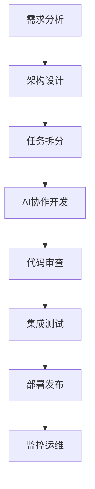

# 中道商城系统 - 项目启动总结

**文档目的**：总结完整的项目准备工作，为开发团队提供全面的启动指南
**适用范围**：所有新加入项目开发的团队成员
**最后更新**：2025年11月18日
**版本**：1.0

---

## 🎯 项目准备工作完成情况

### ✅ 已完成的准备工作

#### 1. 核心业务文档
- [x] **中道商城系统功能规划.md** - 完整的业务逻辑规划
- [x] **项目启动手册.md** - 新人快速上手指南
- [x] **README.md** - 项目总览和快速开始

#### 2. 开发规范文档
- [x] **general.mdc** - AI协作开发约束和规范
- [x] **开发流程与代码规范.md** - 完整的开发流程和编码标准
- [x] **API设计规范.md** - RESTful API设计标准

#### 3. 技术架构文档
- [x] **数据库设计规范.md** - 数据库设计和使用规范
- [x] **环境管理与部署指南.md** - 多环境管理策略
- [x] **部署发布策略.md** - 完整的部署和回滚策略

#### 4. 质量保证文档
- [x] **测试策略与质量保证.md** - 全面的测试策略
- [x] **监控日志与运维策略.md** - 系统监控和运维方案

#### 5. 协作工具文档
- [x] **AI协同开发指南.md** - 多AI协作开发指南
- [x] **AI协同管理系统实现** - 完整的协作工具代码

#### 6. 自动化脚本
- [x] **quick-start.sh** - 一键启动开发环境
- [x] **env-manager.sh** - 环境管理工具
- [x] **start-collaboration.sh** - AI协同启动脚本
- [x] **ai-collaboration.ts** - AI协作管理系统

---

## 🚀 快速启动流程

### 第一步：环境准备（5分钟）

```bash
# 1. 克隆项目
git clone <repository-url>
cd zhongdao-mall

# 2. 一键启动开发环境
chmod +x scripts/quick-start.sh
./scripts/quick-start.sh
```

### 第二步：阅读核心文档（30分钟）

```bash
# 必读文档（按优先级）：
docs/项目启动手册.md          # 📖 首先阅读
docs/中道商城系统功能规划.md    # 🎯 理解业务核心
docs/AI协同开发指南.md          # 🤖 了解协作方式
general.mdc                    # ⚖️ 掌握开发约束
```

### 第三步：启动AI协作系统（5分钟）

```bash
# 启动AI协同开发
./scripts/start-collaboration.sh

# 查看AI状态
./scripts/start-collaboration.sh status

# 查看任务列表
npx ts-node scripts/ai-collaboration.ts tasks
```

### 第四步：开始开发（立即开始）

```bash
# 领取你的第一个任务
npx ts-node scripts/ai-collaboration.ts create-task \
  --title "熟悉项目代码结构" \
  --description "分析现有代码结构，理解业务逻辑实现" \
  --priority low

# 开始开发
npm run dev
```

---

## 📚 文档体系总览

### 🎯 核心业务层
```
docs/
├── 中道商城系统功能规划.md      # 🎯 业务逻辑核心（最重要）
├── 项目启动手册.md              # 📖 新人指南
└── README.md                   # 📋 项目总览
```

### 🛠️ 开发规范层
```
docs/
├── general.mdc                 # ⚖️ AI协作约束（关键）
├── 开发流程与代码规范.md         # 🔧 开发规范
├── API设计规范.md              # 🌐 API标准
└── 数据库设计规范.md            # 🗄️ 数据库标准
```

### 🏗️ 技术架构层
```
docs/
├── 环境管理与部署指南.md        # 🌍 环境管理
├── 部署发布策略.md              # 🚀 部署策略
└── 监控日志与运维策略.md        # 📊 运维监控
```

### 🧪 质量保证层
```
docs/
├── 测试策略与质量保证.md        # 🧪 测试策略
├── AI协同开发指南.md           # 🤖 协作指南
└── 项目启动总结.md             # 📝 启动总结（本文档）
```

---

## 🤖 AI协作系统

### AI角色分工
| AI角色 | 专业领域 | 主要职责 | 联系方式 |
|--------|----------|----------|----------|
| **协调AI** | 项目管理 | 任务分配、进度跟踪 | 任务系统 |
| **架构师AI** | 系统设计 | 技术架构、数据库设计 | 任务系统 |
| **用户系统AI** | 用户管理 | 认证授权、等级体系 | 任务系统 |
| **店铺系统AI** | 店铺管理 | 店铺功能、库存订单 | 任务系统 |
| **测试AI** | 质量保证 | 单元测试、集成测试 | 任务系统 |
| **文档AI** | 技术文档 | API文档、开发指南 | 任务系统 |

### 协作工作流程


---

## 🎯 核心业务理解要点

### 🎖️ 用户等级体系（必须掌握）
- **6级用户路径**：普通会员 → VIP → 一星至五星店长 → 董事
- **升级逻辑**：销量要求（总销售额÷599元）+ 团队要求（直推下级数量）
- **等级约束**：绝对不能修改等级定义和升级逻辑

### 🏪 双店铺体系（核心特色）
- **云店**：基于销量累积的智能升级体系
- **五通店**：一次性27,000元，终身买10赠1权益
- **关键区别**：升级逻辑和权益机制完全不同

### 💰 复杂采购规则（业务核心）
- **层级限制**：只能向更高级别且非平级的上级进货
- **业绩计算**：采购链路中所有中间人都算业绩
- **佣金分配**：不同等级有不同的直推奖励和团队佣金

### 📦 双仓库存机制（重要创新）
- **云仓**：团队共享的虚拟库存中心
- **本地仓**：店长的实体库存，用于零售
- **流转规则**：只能从云仓→本地仓单向流转

### 💎 通券流转体系（财务核心）
- **多源流转**：进货转账 + 用户转账 + 平台充值
- **安全要求**：所有操作必须使用数据库事务
- **审计要求**：完整的流水记录用于审计

---

## 🔧 开发环境配置

### 环境层级
```bash
# 四层环境架构
development    # 开发环境（本地开发）
testing        # 测试环境（功能测试）
staging        # 预发布环境（上线前验证）
production     # 生产环境（正式服务）
```

### 环境切换
```bash
# 环境管理命令
./scripts/env-manager.sh switch development    # 切换到开发环境
./scripts/env-manager.sh switch testing       # 切换到测试环境
./scripts/env-manager.sh switch staging       # 切换到预发布环境
./scripts/env-manager.sh switch production    # 切换到生产环境（需权限）

# 查看当前状态
./scripts/env-manager.sh status
```

### 服务启动
```bash
# 开发环境启动
npm run dev                    # 启动开发服务器
npm run dev:debug             # 启动调试模式

# 生产环境启动
npm run start                  # 启动生产服务器
npm run start:cluster         # 启动集群模式
```

---

## 📋 开发检查清单

### 🎯 业务逻辑检查
- [ ] 理解用户等级升级算法
- [ ] 掌握采购权限验证规则
- [ ] 熟悉双店铺差异化逻辑
- [ ] 了解库存流转机制
- [ ] 掌握通券流转安全要求

### 🔧 技术实现检查
- [ ] 遵循TypeScript严格模式
- [ ] 所有业务操作使用事务
- [ ] 错误处理完整准确
- [ ] API设计遵循RESTful规范
- [ ] 数据库设计符合规范

### 🧪 质量保证检查
- [ ] 单元测试覆盖率达标（>80%）
- [ ] 集成测试覆盖关键业务流程
- [ ] 代码风格符合规范
- [ ] 性能测试满足要求
- [ ] 安全测试通过

### 🤖 协作流程检查
- [ ] 遵循AI协作规范
- [ ] 及时更新任务状态
- [ ] 积极参与代码审查
- [ ] 分享开发经验和知识
- [ ] 遵循沟通协作原则

---

## 🚨 重要约束和提醒

### ❌ 绝对不能违反的业务规则
1. **用户等级定义不能修改** - 6级体系是业务核心
2. **采购权限规则必须严格执行** - 层级限制是业务基础
3. **双店铺逻辑不能混淆** - 云店和五通店机制完全不同
4. **库存流转规则必须遵守** - 双仓机制是创新特色
5. **通券流转必须使用事务** - 资金安全是最高优先级

### ✅ 必须遵循的技术规范
1. **TypeScript严格模式** - 避免any类型，确保类型安全
2. **数据库事务** - 所有业务操作必须使用事务
3. **错误处理完整** - 不能有任何未处理的异常
4. **测试覆盖达标** - 关键业务逻辑100%覆盖
5. **API设计规范** - 严格遵循RESTful设计原则

### 🤖 AI协作必须遵守的规范
1. **遵循general.mdc约束** - 所有AI必须严格执行
2. **尊重专业领域分工** - 不跨界修改其他AI负责的代码
3. **及时沟通协作** - 遇到问题主动通过任务系统沟通
4. **质量第一原则** - 代码质量比开发速度更重要
5. **知识共享义务** - 积极分享经验和最佳实践

---

## 🎉 开发准备完成

### ✅ 准备工作确认清单

#### 文档准备（100%完成）
- [x] 业务逻辑文档完整准确
- [x] 开发规范全面清晰
- [x] 技术架构设计完善
- [x] 质量保证策略完备
- [x] 协作工具就绪可用

#### 工具准备（100%完成）
- [x] 一键启动脚本可用
- [x] 环境管理工具完善
- [x] AI协作系统就绪
- [x] 自动化部署脚本
- [x] 监控运维工具

#### 团队准备（待确认）
- [ ] 团队成员已阅读必读文档
- [ ] 开发环境已配置完成
- [ ] AI协作系统已启动
- [ ] 开发规范已理解接受
- [ ] 协作流程已熟悉掌握

---

## 🚀 开始开发

### 立即可以开始的行动

1. **启动开发环境**
   ```bash
   ./scripts/quick-start.sh
   ```

2. **启动AI协作系统**
   ```bash
   ./scripts/start-collaboration.sh
   ```

3. **领取第一个任务**
   ```bash
   npx ts-node scripts/ai-collaboration.ts tasks
   ```

4. **开始编码**
   ```bash
   npm run dev
   ```

### 🎯 开发目标

- **短期目标（1个月）**：完成核心业务模块开发
- **中期目标（3个月）**：完成MVP版本上线
- **长期目标（12个月）**：实现完整业务愿景

### 💡 开发建议

1. **先理解业务再编码** - 业务逻辑是系统的核心
2. **严格遵循规范** - 规范是团队协作的基础
3. **质量优先于速度** - 代码质量决定项目成败
4. **积极沟通协作** - 团队力量大于个人能力
5. **持续学习改进** - 技术和业务都在不断发展

---

## 📞 获取帮助

### 📚 查阅文档
- **业务问题**：查看 `docs/中道商城系统功能规划.md`
- **技术问题**：查看相应的技术规范文档
- **协作问题**：查看 `docs/AI协同开发指南.md`

### 🤖 AI协作支持
- **任务系统**：通过AI协作系统提交问题
- **代码审查**：相关AI会提供专业建议
- **技术支持**：架构师AI提供技术指导

### 👥 团队支持
- **紧急问题**：联系项目协调人
- **技术讨论**：团队技术讨论群
- **业务咨询**：产品经理或业务专家

---

**🎉 恭喜！中道商城系统的项目准备工作已全面完成！**

**现在可以开始愉快的开发旅程了！让我们一起构建这个创新的多层级供应链社交电商平台！** 🚀

---

**最后更新：2025年11月18日**
**版本：1.0**
**维护者：开发团队**