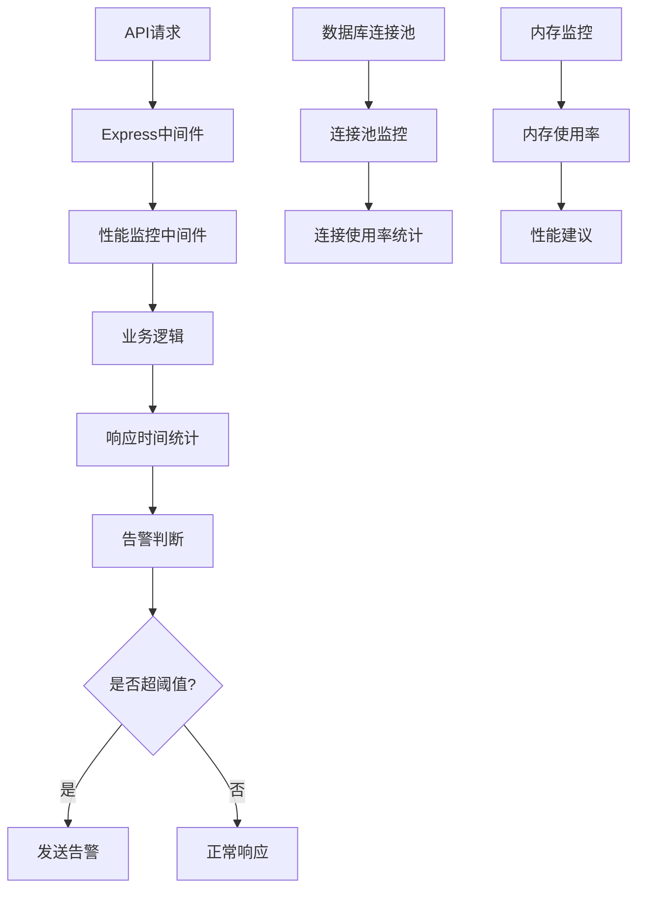
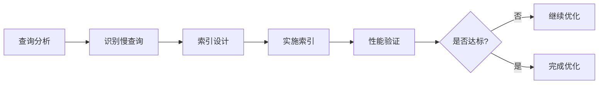
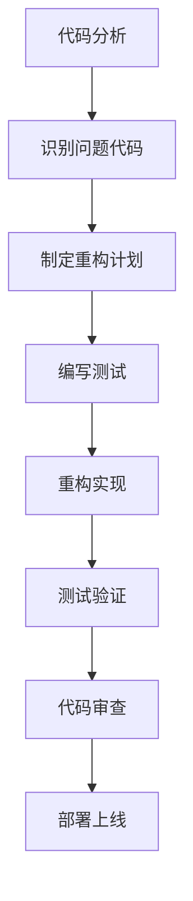
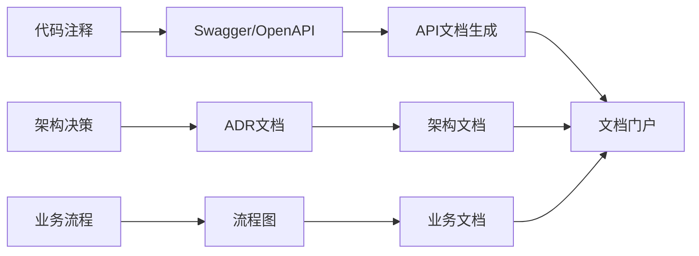

# 中道商城系统优化 - 技术解决方案设计

## 技术架构概览

基于现有 Node.js + TypeScript + Express + Prisma + MySQL 技术栈，设计4个关键优化领域的技术解决方案。

## 1. 系统健康监控体系

### 技术架构

### 技术组件
- **监控中间件**: Express 中间件集成，记录响应时间和状态
- **数据库监控**: Prisma 连接池状态监控
- **内存监控**: Node.js process.memoryUsage() API
- **告警系统**: 基于阈值的告警机制
- **日志记录**: Winston 结构化日志

### 实施策略
1. 在 `src/shared/middleware/` 下创建性能监控中间件
2. 集成到现有的 Express 应用中
3. 创建监控数据收集端点 `/api/v1/health/metrics`

## 2. 数据库查询性能优化

### 索引优化策略

### 技术实现
- **慢查询日志**: MySQL slow_query_log 配置
- **查询分析**: EXPLAIN 查询执行计划分析
- **索引策略**:
  - 复合索引用于多字段查询
  - 部分索引用于大数据表
  - 函数索引用于特殊查询
- **查询缓存**: Redis 查询结果缓存
- **分页优化**: cursor-based 分页实现

### 具体优化点
1. `pointsTransactions` 表索引优化
2. 用户层级查询优化
3. 团队关系路径查询优化
4. 订单查询性能提升

## 3. 代码重构清理技术负债

### 重构方法论

### 重构重点领域
- **模块化改进**:
  - 分离业务逻辑与数据访问
  - 统一错误处理机制
  - 规范化API响应格式
- **类型安全**:
  - 强化 TypeScript 类型定义
  - 移除 any 类型使用
  - 完善接口定义
- **依赖注入**:
  - 减少模块间耦合
  - 提高代码可测试性
- **配置管理**:
  - 统一环境配置
  - 动态配置更新

### 重构工具
- **静态分析**: ESLint + TypeScript 编译器
- **代码质量**: SonarQube 或类似工具
- **测试覆盖**: Vitest 覆盖率报告
- **重构工具**: IDE 重构功能 + TypeScript

## 4. API和架构文档完善

### 文档架构设计

### 技术实现
- **API文档**:
  - Swagger/OpenAPI 3.0 规范
  - 自动生成基于 JSDoc 注释
  - 交互式API文档界面
- **架构文档**:
  - Architecture Decision Records (ADR)
  - C4 模型架构图
  - 业务流程图
- **文档部署**:
  - 静态文档站点
  - 版本控制
  - 搜索功能

### 文档工具栈
- **文档生成**: Swagger UI + Redoc
- **图表绘制**: Mermaid.js + PlantUML
- **文档站点**: Docusaurus 或 VuePress
- **版本管理**: Git + 文档版本标记

## 测试策略

### 单元测试
- 测试覆盖率目标: 80%+
- 测试框架: Vitest
- Mock策略: 模拟外部依赖

### 集成测试
- API端到端测试
- 数据库集成测试
- 第三方服务Mock

### 性能测试
- 负载测试: Artillery 或 k6
- 压力测试: 并发用户模拟
- 基准测试: 前后性能对比

## 安全考虑

### API安全
- JWT token 验证强化
- 请求频率限制
- 输入验证和清理
- SQL注入防护

### 数据安全
- 敏感数据加密
- 访问权限控制
- 审计日志记录
- 数据备份策略

## 部署策略

### 持续集成/持续部署
- 自动化测试流水线
- 代码质量门禁
- 分阶段部署
- 回滚机制

### 监控告警
- 应用性能监控
- 错误追踪系统
- 基础设施监控
- 业务指标监控

## 技术风险和缓解

### 风险识别
1. **数据库迁移风险**: 备份 + 分步迁移
2. **API兼容性风险**: 版本控制 + 向后兼容
3. **性能回退风险**: 基准测试 + 性能监控
4. **业务中断风险**: 蓝绿部署 + 快速回滚

### 缓解措施
- 充分的测试覆盖
- 灰度发布策略
- 实时监控告警
- 快速回滚机制

## 成功指标

### 技术指标
- API平均响应时间 < 500ms
- 数据库查询时间 < 200ms
- 系统可用性 > 99.9%
- 测试覆盖率 > 80%
- 代码质量评分 > B级

### 业务指标
- 用户投诉率下降 50%
- 开发效率提升 40%
- 系统稳定性提升 30%
- 技术负债减少 60%