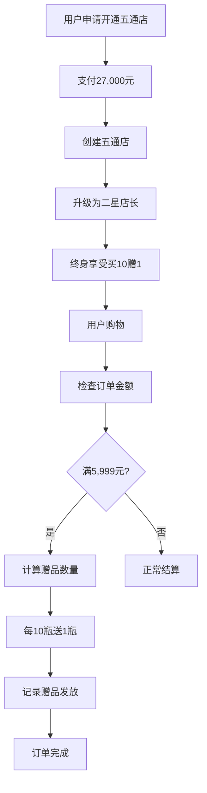

# 五通店特殊业务逻辑系统

## 概述

五通店系统是中道商城的特色商业模式，提供独特的买10赠1机制和终身权益。这是平台差异化竞争的核心功能。

## 核心特性

### 🎯 商业模式
- **准入门槛**: 一次性拿货100瓶×270元/瓶 = 27,000元
- **终身权益**: 买10赠1机制，满5,999元送599元商品
- **升级特权**: 普通/VIP会员直接升级为二星店长
- **特殊地位**: 与云店并行的高级店铺类型

### 🎁 买10赠1机制
- **触发条件**: 订单金额满5,999元
- **计算规则**: 每满10瓶送1瓶同款商品
- **智能选择**: 优先同款赠品，库存不足时选择等值商品
- **终身有效**: 不限次数，永久享受

### ⭐ 升级特权
- **普通会员**: 开通五通店 → 直接成为二星店长
- **VIP会员**: 开通五通店 → 直接成为二星店长
- **权益叠加**: 享受二星店长所有权益（3.5折进货价、团队管理等）

## 系统架构

```
src/modules/shop/
├── wutong.service.ts          # 核心业务逻辑
├── wutong.controller.ts       # HTTP API控制器
├── wutong.routes.ts          # API路由定义
├── wutong.test.ts            # 功能测试
├── wutong.examples.md        # API使用示例
├── shop.service.ts           # 基础店铺服务（已集成）
├── types.ts                  # 类型定义和配置
└── README.md                 # 本文档
```

### 数据库模型

```sql
-- 核心表结构
User              -- 用户表（已有hasWutongShop字段）
Shop              -- 店铺表（支持ShopType.WUTONG）
GiftRecord        -- 赠品记录表（新增）
LevelUpgradeRecord -- 等级升级记录表（新增）
```

### 业务流程



## API文档

### 基础配置

```typescript
// 五通店配置
export const WUTONG_SHOP_CONFIG = {
  name: '五通店',
  entryFee: 27000,          // 开通费用
  bottleCount: 100,         // 拿货数量
  unitPrice: 270,           // 单价
  giftThreshold: 5999,      // 赠品门槛
  giftValue: 599,           // 赠品价值
  giftRatio: 0.1            // 赠送比例
};
```

### 主要API端点

| 方法 | 端点 | 说明 | 认证 |
|------|------|------|------|
| GET | `/api/wutong/qualification` | 验证五通店资格 | 需要 |
| POST | `/api/wutong/calculate-benefit` | 计算买10赠1权益 | 需要 |
| POST | `/api/wutong/open-shop` | 开通五通店 | 需要 |
| GET | `/api/wutong/statistics` | 获取统计数据 | 需要 |
| GET | `/api/wutong/benefits` | 获取权益说明 | 不需要 |

### 请求/响应格式

#### 计算权益请求
```json
{
  "cartItems": [
    {
      "productId": "prod_123",
      "productName": "产品名称",
      "quantity": 15,
      "unitPrice": 599,
      "totalPrice": 8985
    }
  ]
}
```

#### 权益计算响应
```json
{
  "success": true,
  "data": {
    "qualifies": true,
    "orderAmount": 8985,
    "freeQuantity": 1,
    "freeProducts": [...],
    "savingsAmount": 599,
    "message": "恭喜！您获得了1件赠品"
  }
}
```

## 核心服务使用

### 1. 验证五通店资格

```typescript
import { wutongService } from './wutong.service';

const qualification = await wutongService.validateWutongBenefit(userId);
if (qualification.canUseBenefits) {
  console.log('用户享有五通店权益');
}
```

### 2. 计算买10赠1权益

```typescript
const cartItems = [
  {
    productId: 'prod_1',
    productName: '测试产品',
    quantity: 25,
    unitPrice: 600,
    totalPrice: 15000
  }
];

const result = await wutongService.calculateWutongBenefit(userId, cartItems);

if (result.qualifies) {
  console.log(`获得${result.freeQuantity}件赠品，价值${result.savingsAmount}元`);
}
```

### 3. 开通五通店

```typescript
const contactInfo = {
  contactName: '张三',
  contactPhone: '13800138000',
  address: '北京市朝阳区'
};

const result = await wutongService.openWutongShopWithUpgrade(userId, contactInfo);

if (result.success) {
  console.log(`开通成功！已升级为${result.newLevel}`);
}
```

### 4. 记录赠品发放

```typescript
await wutongService.recordGiftDistribution(
  userId,
  orderId,
  result.freeProducts
);
```

## 业务规则详细说明

### 买10赠1计算规则

1. **门槛验证**
   - 订单总金额 ≥ 5,999元
   - 仅计算参与活动的商品

2. **赠品数量**
   - 计算符合条件的商品总瓶数
   - 每10瓶赠送1瓶（向下取整）

3. **赠品选择**
   - 优先选择同款商品作为赠品
   - 库存不足时选择等值其他商品
   - 单个赠品价值不超过599元

4. **权益限制**
   - 终身有效，无使用次数限制
   - 与其他促销活动可叠加使用

### 升级特权规则

1. **适用对象**
   - 普通会员（NORMAL）
   - VIP会员（VIP）

2. **升级目标**
   - 直接升级为二星店长（STAR_2）
   - 如果已是二星店长或更高等级，保持原等级

3. **升级时机**
   - 五通店开通时立即生效
   - 自动创建升级记录

### 数据一致性要求

1. **事务完整性**
   - 五通店开通与用户升级在同一事务中
   - 赠品记录与订单状态保持一致

2. **状态同步**
   - 五通店状态与用户等级同步更新
   - 权益使用与库存变更实时同步

3. **异常处理**
   - 重复开通检测和拒绝
   - 库存不足时的替代方案
   - 升级失败时的回滚机制

## 部署和配置

### 1. 数据库迁移

```sql
-- 创建新的数据表
-- GiftRecord, LevelUpgradeRecord
-- 添加User表关系字段
```

### 2. 系统配置

```json
{
  "wutong_gift_products": ["prod_1", "prod_2"], // 参与活动的商品ID
  "wutong_enabled": true,
  "wutong_entry_fee": 27000
}
```

### 3. 路由集成

```typescript
// 在主路由文件中添加
import wutongRoutes from './modules/shop/wutong.routes';
app.use('/api/wutong', wutongRoutes);
```

## 测试

### 运行测试

```bash
# 运行五通店相关测试
npm test -- wutong.test.ts

# 运行所有测试
npm test
```

### 测试覆盖范围

- ✅ 五通店资格验证
- ✅ 买10赠1计算逻辑
- ✅ 开通五通店流程
- ✅ 升级特权处理
- ✅ 赠品记录功能
- ✅ 统计数据查询

## 性能优化

### 1. 缓存策略
- 用户五通店资格缓存
- 参与活动商品列表缓存
- 计算结果短期缓存

### 2. 数据库优化
- 添加必要的索引
- 优化复杂查询
- 分页处理大数据集

### 3. 异步处理
- 赠品计算异步化
- 统计数据预计算
- 邮件通知队列化

## 监控和日志

### 关键指标
- 五通店开通数量
- 买10赠1使用次数
- 赠品发放成功率
- 升级特权使用情况

### 日志记录
- 所有五通店操作记录详细日志
- 异常情况包含完整上下文
- 性能监控和慢查询记录

## 常见问题

### Q: 五通店和云店有什么区别？
A: 五通店是一次性投资27,000元的特权店铺，终身享受买10赠1权益。云店是基于业绩逐步升级的店铺类型。

### Q: 买10赠1可以和优惠券同时使用吗？
A: 可以。五通店权益与其他促销活动不冲突，可以叠加享受。

### Q: 如果已经是三星店长，开通五通店还有意义吗？
A: 仍有意义。可以享受买10赠1权益，获得额外赠品和收益。

### Q: 赠品如何发货？
A: 赠品随主订单一同发货，或单独发货，系统会记录完整的赠品发放状态。

## 技术支持

如有技术问题，请联系开发团队或查看相关文档：

- API文档: `wutong.examples.md`
- 测试用例: `wutong.test.ts`
- 类型定义: `types.ts`
- 配置说明: `schema.prisma`

---

**中道商城 - 五通店系统**
*实现差异化竞争优势的核心功能*